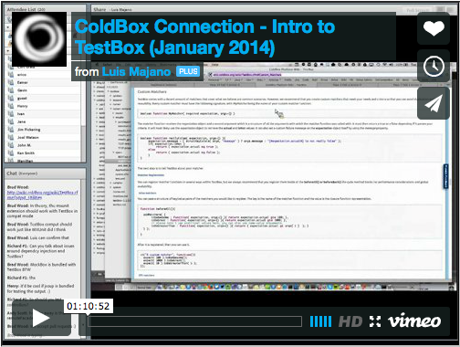

```
  _____         _   ____            
 |_   _|__  ___| |_| __ )  _____  __
   | |/ _ \/ __| __|  _ \ / _ \ \/ /
   | |  __/\__ \ |_| |_) | (_) >  < 
   |_|\___||___/\__|____/ \___/_/\_\ v2.2.0

    _   
  _| |_ 
 |_   _|
   |_|  
        
  __  __            _    ____            
 |  \/  |          | |  |  _ \           
 | \  / | ___   ___| | _| |_) | _____  __
 | |\/| |/ _ \ / __| |/ /  _ < / _ \ \/ /
 | |  | | (_) | (__|   <| |_) | (_) >  < 
 |_|  |_|\___/ \___|_|\_\____/ \___/_/\_\
                                         
                                                                             
```
# TestBox & MockBox Manual v2.2.0


TestBox is a next generation testing framework for ColdFusion (CFML) that is based on [BDD](http://en.wikipedia.org/wiki/Behavior-driven_development) (Behavior Driven Development) for providing a clean obvious syntax for writing tests. It contains not only a testing framework, runner, assertions and expectations library but also ships with MockBox for mocking and stubbing. It also supports xUnit style of testing and MXUnit compatibilities.


MockBox is a companion package to TestBox that will give you advanced mocking/stubbing capabilities; hence a Mocking Framework.


<a href="https://vimeo.com/85396307"></a>


# Versioning
TestBox is maintained under the [Semantic Versioning](http://semver.org) guidelines as much as possible.Releases will be numbered with the following format:

```
<major>.<minor>.<patch>
```

And constructed with the following guidelines:

* Breaking backward compatibility bumps the major (and resets the minor and patch)
* New additions without breaking backward compatibility bumps the minor (and resets the patch)
* Bug fixes and misc changes bumps the patch


# License
TestBox and MockBox are open source and licensed under the [Apache 2](http://www.apache.org/licenses/LICENSE-2.0.html) License.  If you use them
please try to make mention of it in your code or web site.

* Copyright by Ortus Solutions, Corp
* TestBox is a registered trademark by Ortus Solutions, Corp


>**Info**: The ColdBox Websites, Documentation, logo and content have a separate license and they are a separate entity.

# Discussion & Help
The TestBox help and discussion group can be found here: https://groups.google.com/a/ortussolutions.com/forum/#!forum/testbox

# Reporting a Bug
We all make mistakes from time to time :) So why not let us know about it and help us out.  We also love pull requests, so please star us and fork us: https://github.com/Ortus-Solutions/TestBox
* By Jira: https://ortussolutions.atlassian.net/browse/TESTBOX

# Professional Open Source


TestBox is a professional open source software backed by [Ortus Solutions, Corp](http://www.ortussolutions.com/products/testbox) offering services like:
* Custom Development
* Professional Support & Mentoring
* Training
* Server Tuning
* Security Hardening
* Code Reviews
* [Much More](http://www.ortussolutions.com/services)

# Resources
* Official Site: http://www.ortussolutions.com/products/testbox
* Help Group: https://groups.google.com/a/ortussolutions.com/forum/#!forum/testbox
* Source Code: https://github.com/Ortus-Solutions/TestBox
* Bug Trackers
 * https://ortussolutions.atlassian.net/browse/TESTBOX
 * https://ortussolutions.atlassian.net/browse/MOCKBOX
* Twitter: [@ortussolutions](http://www.twitter.com/ortussolutions)
* Facebook: https://www.facebook.com/ortussolutions
* Google+: https://plus.google.com/u/0/b/107581581269566431930/+OrtusSolutions


---

### HONOR GOES TO GOD ABOVE ALL
Because of His grace, this project exists. If you don't like this, then don't read it, its not for you.


> Therefore being justified by **faith**, we have peace with God through our Lord Jesus Christ:
By whom also we have access by **faith** into this **grace** wherein we stand, and rejoice in hope of the glory of God. - Romans 5:5

---


