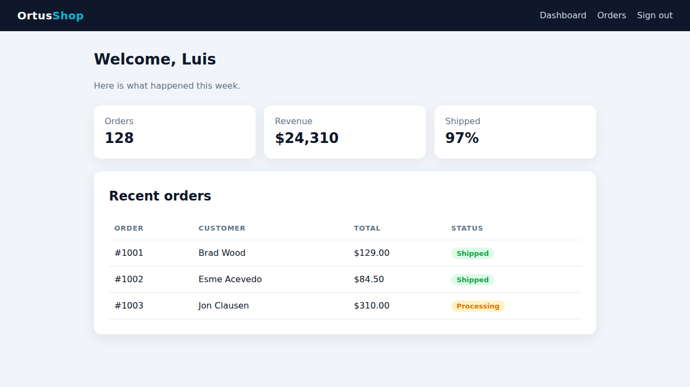

# Attachments

A failing browser test is much easier to fix when you can see the page. TestBox lets any spec **attach files** to its result: screenshots, Playwright traces, videos, logs, HAR files or anything else. Reporters list the attachments under the spec, and the JUnit reports expose them to Jenkins and GitLab.

`BrowserSpec` attaches the screenshots, trace and videos of a failed `browse()` call for you, and you can call `attach()` from any spec, on any engine.

## `attach()`

```java
attach( required string path, string type = "file", string name = "" )
```

| Argument | Default | Description |
| --- | --- | --- |
| `path` | | The absolute path of the file. |
| `type` | `file` | The kind of file, for example `file`, `screenshot`, `trace`, `video` or `log`. Reporters show it next to the name. |
| `name` | the file name | The display name. Defaults to the file name of `path`. |

`attach()` returns the spec, so calls chain. Attachments are kept for **passed and failed** specs alike.




```java
class extends="testbox.system.BaseSpec" {

    function run() {
        describe( "Monthly report", () => {

            afterEach( () => {
                // Keep the application log of every spec
                attach( expandPath( "/logs/app.log" ), "log" )
            } )

            it( "renders the PDF", () => {
                var pdf = getTempDirectory() & "report.pdf"
                new models.Reports().monthly( pdf )

                attach( path = pdf, type = "file", name = "Monthly report" )
                expect( fileExists( pdf ) ).toBeTrue()
            } )

        } )
    }

}
```





```cfscript
component extends="testbox.system.BaseSpec" {

    function run(){
        describe( "Monthly report", function(){

            afterEach( function(){
                // Keep the application log of every spec
                attach( expandPath( "/logs/app.log" ), "log" );
            } );

            it( "renders the PDF", function(){
                var pdf = getTempDirectory() & "report.pdf";
                new models.Reports().monthly( pdf );

                attach( path = pdf, type = "file", name = "Monthly report" );
                expect( fileExists( pdf ) ).toBeTrue();
            } );

        } );
    }

}
```




In xUnit bundles, call `attach()` from the test method, `setup()` or `teardown()`.


`attach()` only works while a spec runs, on the thread running it: from a spec body, `beforeEach()`, `afterEach()` or `aroundEach()` (or `setup()`, a test method and `teardown()` in xUnit). Anywhere else, such as `beforeAll()` or a thread you spawned, it throws `TestBox.InvalidContext`.


TestBox records the path you give it; it does not copy the file. Keep attached files where your CI job can collect them, and do not delete them in `afterAll()` if you want to look at them later.

## Automatic Browser Artifacts


Automatic browser artifacts require BoxLang and bx-playwright, like every [`BrowserSpec`](README.md) feature. On CFML engines browser specs are skipped before any artifact is recorded.


bx-playwright records screenshots, traces and videos according to its **artifact policies**. They are all `off` by default. Turn them on with a profile, for example the built-in `ci` profile, or with the `artifacts` setting or `browse()` option:

| Policy | Keeps |
| --- | --- |
| `off` | nothing |
| `on` | always |
| `only-on-failure` / `retain-on-failure` | only when the browser context closes as failed |

The `ci` profile keeps a screenshot (`only-on-failure`), a trace and videos (`retain-on-failure`) of every failed context:

```java
@browserProfile( "ci" )
class extends="testbox.system.BrowserSpec" {
    // ...
}
```

Or per `browse()` call:

```java
browse(
    ( page ) => {
        page.visit( "/checkout" ).click( "Pay now" )
        expect( page ).toSee( "Thank you" )
    },
    {
        artifacts : {
            screenshot : "only-on-failure",
            trace      : "retain-on-failure",
            directory  : expandPath( "/tests/results/artifacts" )
        }
    }
)
```

When the `browse()` closure throws, whether from a matcher, a bx-playwright assertion or any other error, TestBox closes each browser context as failed, attaches what the policies kept to the running spec, then rethrows the original exception:

| Kept file | Attachment type |
| --- | --- |
| Screenshot of each page | `screenshot` |
| Playwright trace (a `.zip`) | `trace` |
| Video of each page | `video` |

This is the screenshot TestBox attached when the spec expected the last order to be `Shipped` but the page showed `Processing`:

<figure><figcaption><p>The failure screenshot: the last order is still Processing</p></figcaption></figure>

Files go to `~/.boxlang/playwright/artifacts` unless you set `artifacts.directory`. When the closure passes, nothing is kept or attached for the `on-failure` policies. More on policies in the [bx-playwright testing guide](https://bxplaywright.boxlang.io/testing/).

### Opening a Trace

A trace records every action, a DOM snapshot before and after it, the console and the network. Open one in the Playwright trace viewer:

```bash
bxPlaywright show-trace tests/results/artifacts/trace.zip
```

Select an action to see the page at that moment, the call parameters and the error. Here the `hasText` assertion waited 5 seconds for `Shipped` and the trace shows the `Processing` pill it found instead:

<figure><figcaption><p>The failed assertion in the Playwright trace viewer</p></figcaption></figure>

## Attachments in Reports

| Reporter or output | Shows |
| --- | --- |
| JSON (`json`) and Raw | An `attachments` array of `{ path, type, name }` in every spec's stats, passed or failed. |
| Simple (`simple`) | A paperclip list under the spec, each name linking to its file. |
| JUnit (`junit`) and ANT JUnit (`antjunit`) | A `<system-out>` element on the test case with one `[[ATTACHMENT\|path]]` line per file. |
| Text (`text`), Console (`console`) and the BoxLang runner `--stream` output | The attachments of **failed and errored** specs, listed under the failure with their name, type and path. |

<figure><figcaption><p>The Simple reporter links each attachment under the failing spec</p></figcaption></figure>

The JUnit output follows the convention of the Jenkins [JUnit Attachments plugin](https://plugins.jenkins.io/junit-attachments/), which GitLab also reads for its test reports:

```xml
<testcase name="pays with a card" classname="tests.specs.CheckoutSpec" time="3.2">
    <failure message="Locator expected to be visible ...">...</failure>
    <system-out>[[ATTACHMENT|/builds/app/tests/results/artifacts/checkout-1.png]]
[[ATTACHMENT|/builds/app/tests/results/artifacts/trace.zip]]</system-out>
</testcase>
```

* **Jenkins:** install the JUnit Attachments plugin and publish the JUnit report. Attachments appear on each test result page.
* **GitLab:** publish the report as `artifacts:reports:junit` and keep the attached files in the job artifacts. GitLab shows screenshots on the failed test in the merge request test report. It resolves the paths inside the job artifacts, so write artifacts under the project directory, for example with `artifacts.directory`.

When you consume results programmatically, read the attachments from the spec stats:



```java
var results = new testbox.system.TestBox( bundles = "tests.specs.CheckoutSpec" ).runRaw()
var spec    = results.getBundleStats()[ 1 ].suiteStats[ 1 ].specStats[ 1 ]

for ( var attachment in spec.attachments ) {
    println( "#attachment.name# (#attachment.type#): #attachment.path#" )
}
```



```cfscript
var results = new testbox.system.TestBox( bundles = "tests.specs.CheckoutSpec" ).runRaw();
var spec    = results.getBundleStats()[ 1 ].suiteStats[ 1 ].specStats[ 1 ];

for ( var attachment in spec.attachments ) {
    writeOutput( "#attachment.name# (#attachment.type#): #attachment.path#<br>" );
}
```



See [Reporters](../digging-deeper/reporters/README.md) for how to choose a reporter.
