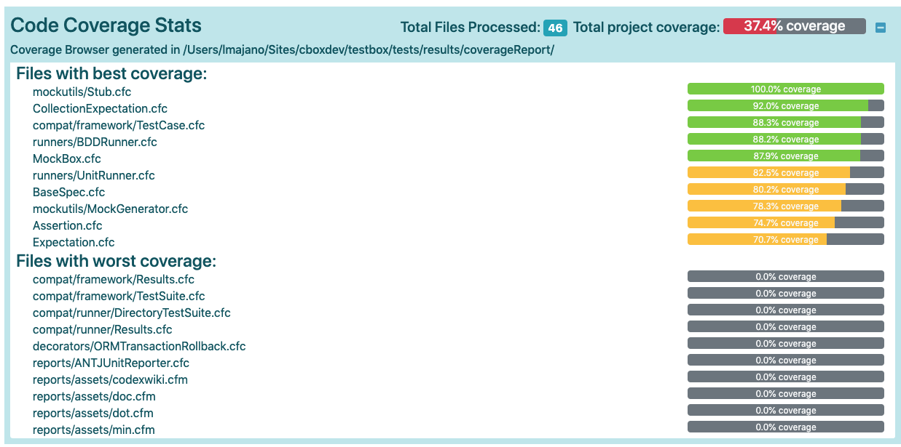

# Running Code Coverage

In order to use TestBox Code Coverage, you will need TestBox 3.x or higher installed, a licensed installation of [FusionReactor](https://www.fusion-reactor.com/) and a working test suite. You may have some or all of these already so skip the sections that don't apply to you.

## Fusion Reactor

If you don't have FusionReactor installed, you can do so very easily in CommandBox like so:

```bash
install commandbox-fusionreactor
fr register <Your license key here>
```

That's it! All servers you start now will have FusionReactor configured. You can open FusionReactor's web console via the menu item in your server's tray icon. Note, the FusionReactor web admin is not required to get TestBox code coverage.

If you are not using CommandBox for your server, follow the [installation instructions](https://www.fusion-reactor.com/manually-installing-fusionreactor/) on FusionReactor's website. If you need a license key, please [contact FusionReactor](https://www.fusion-reactor.com/download/) to acquire one. Note they have a 2 week trial you can use.

## TestBox 3.x+

To get the latest version of TestBox into a new project, you can install it via CommandBox like so:

```bash
install testbox --saveDev
```

The `--saveDev` flag will store TestBox as a development dependency.

To update a previous installation of TestBox 2.x to the latest, you will need to explicitly ask for 3.x. Please note 3.x may have some breaking changes from 2.x and support different CF engines, so please review the [release notes](broken-reference) first.

```bash
install testbox@3
```

## Test Suite

If you don't have test suite yet, let's install a ColdBox sample app to play with. TestBox does not require ColdBox to work, but the mechanics of the test runner itself are identical so this is the easiest way to get one running. Run these CommandBox commands in an empty directory.

```bash
coldbox create app
server start
```

Inside your directory will be a folder called `/tests` which has our test runner `/tests/runner.cfm`. You will need to open your runner.cfm and default code coverage enabled to true.

```
<!--- Code Coverage requires FusionReactor --->
<cfparam name="url.coverageEnabled"    default="true">
```

## Run your Test Suite

All you need to do now is run your test suite. You can do so by hitting `/tests/runner.cfm` in the URL of your browser, or use the `testbox run` command in CommandBox.

You don't need to configure anything for code coverage to work. TestBox will auto-detect if FusionReactor is installed on your server and will generate the code coverage results for you. In the output of your test reporter, you will see a percentage to represents the number of lines of code (LOC) which were executed divided by the total number of lines of code. Note, code coverage only counts executable lines of code against you, so comments, whitespace, or HTML do not count as an executable LOC.

Keep reading in the next section to find out how to configure the details of code coverage to only look at the files you want and also how to generate the Code Coverage Browser.


