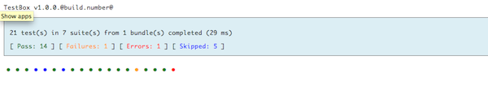
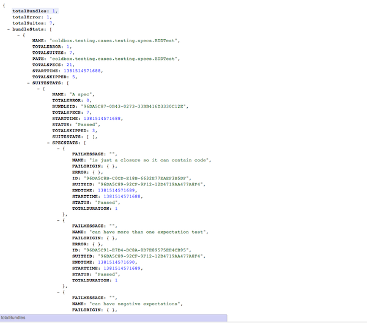
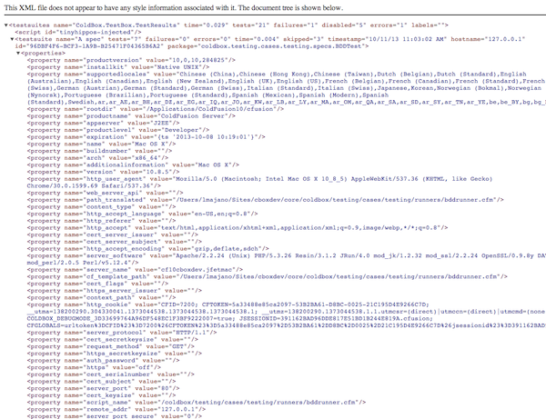
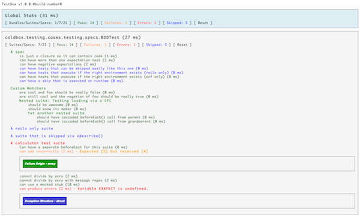
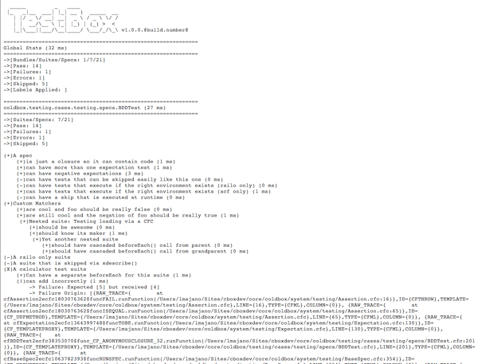
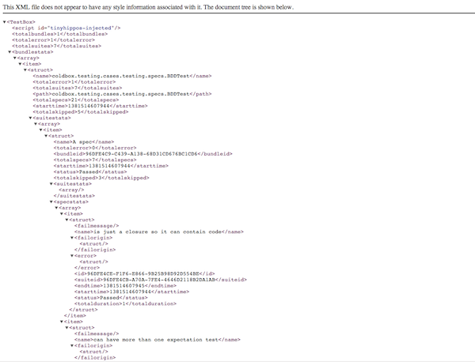

# Reporters

TestBox ships with a rich set of reporters for every use case:

| Reporter | Description |
|----------|-------------|
| `ANTJunit` | JUnit XML variant compatible with the ANT `junitreport` task |
| `Codexwiki` | MediaWiki syntax for use in Codex Wiki (DEPRECATED) |
| `Console` | Sends the report to the console |
| `Doc` | Semantic HTML for documentation-style output |
| `Dot` | Compact dot-matrix report (DEPRECATED) |
| `JSON` | Full JSON report of all results |
| `JUnit` | Standard JUnit-compliant XML report |
| `Min` | Minimalistic HTML view |
| `MinText` | Minimalistic plain-text report |
| `Raw` | Raw BoxLang/CFML struct representation of results |
| `Simple` | Basic HTML reporter with editor link support |
| `Tap` | Test Anything Protocol (TAP) output (DEPRECATED) |
| `Text` | Full plain-text report |
| `XML` | XML-based testing report |

To use a specific reporter, append `reporter` to your runner URL, e.g. `&reporter=Text`, or set it in your `runner.bxm` / `runner.cfm`.

## `ConsoleReporter` — Hiding Skipped Tests

The `ConsoleReporter` now accepts a `hideSkipped` option (default `false`) that suppresses skipped spec output — useful when you have many pending specs and want cleaner terminal output.

```javascript
var testbox = new testbox.system.TestBox(
    bundles  = "tests.specs",
    reporter = {
        type    : "testbox.system.reports.ConsoleReporter",
        options : { hideSkipped : true }
    }
);
```

When using the BoxLang CLI runner, pass `--show-skipped=false` instead:

```bash
./testbox/run --show-skipped=false
```

## `StreamingReporter` — Real-Time SSE Output 🆕

The new `StreamingReporter` (backed by `StreamingRunner`) pushes each spec result to the client in real time via Server-Sent Events. It powers both the [TestBox RUN IDE](../../getting-started/running-tests/testbox-run-ide.md) and the `testbox run --streaming` command.


[streaming-runner.md](../../getting-started/running-tests/streaming-runner.md)


## Open In Editor (Simple Reporter)

The `simple` reporter allows you to set a code editor of choice so it creates clickable links for stack traces and tag contexts — opening exceptions in your editor at the exact line.


The default editor is `vscode`.


Use the `url.editor` parameter in the URL or set it in your `runner.cfm`:

```markup
<cfsetting showDebugOutput="false">
<!--- Executes all tests in the 'specs' folder with simple reporter by default --->
<cfparam name="url.reporter" 			default="simple">
<cfparam name="url.directory" 			default="tests.specs">
<cfparam name="url.recurse" 			default="true" type="boolean">
<cfparam name="url.bundles" 			default="">
<cfparam name="url.labels" 				default="">
<cfparam name="url.excludes" 			default="">
<cfparam name="url.reportpath" 			default="#expandPath( "/tests/results" )#">
<cfparam name="url.propertiesFilename" 	default="TEST.properties">
<cfparam name="url.propertiesSummary" 	default="false" type="boolean">
<cfparam name="url.editor" 				default="vscode">

<!--- Include the TestBox HTML Runner --->
<cfinclude template="/testbox/system/runners/HTMLRunner.cfm" >
```

 (1).png>)


### Available Editors

* atom
* emacs
* espresso
* idea
* macvim
* sublime
* textmate
* vscode
* vscode-insiders

## Reporter Screenshots












