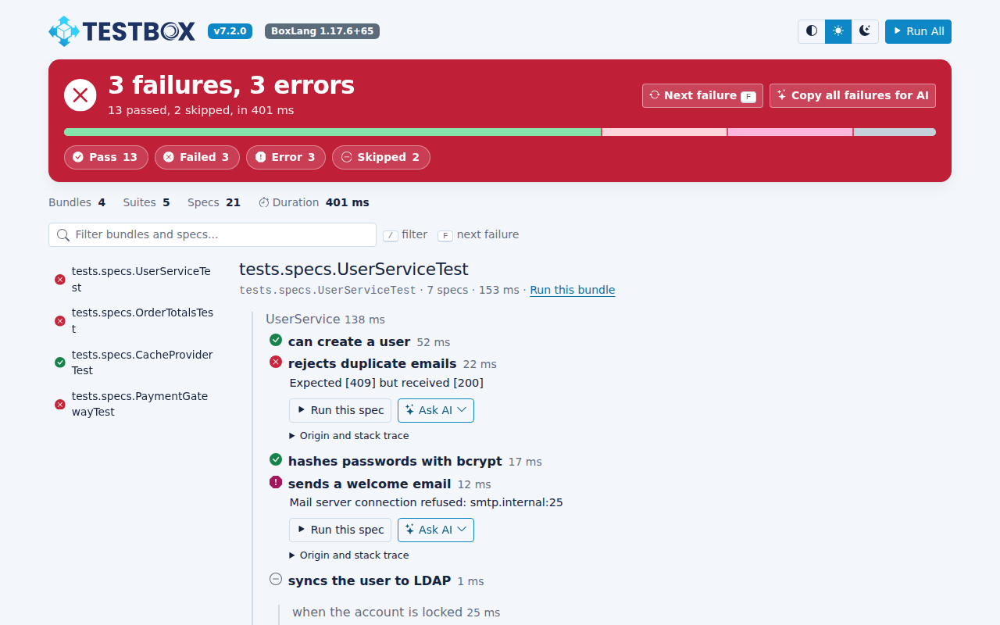
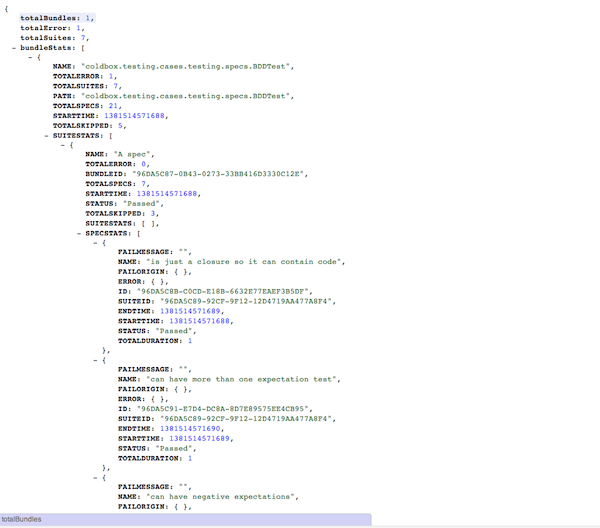
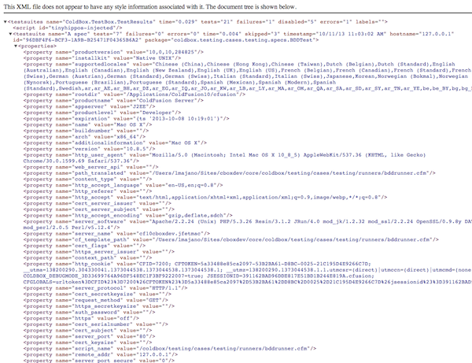
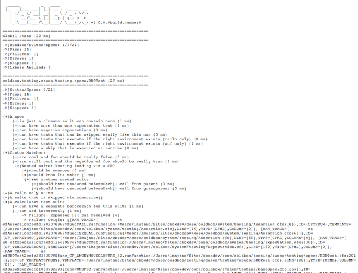
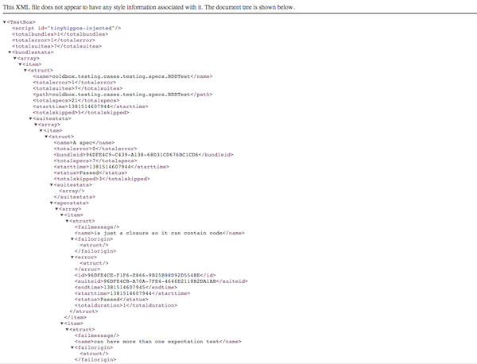

# Reporters

TestBox ships with a rich set of reporters for every use case:

| Reporter | Description |
|----------|-------------|
| `Agent` | Compact, token-efficient JSON for AI agents and automation |
| `ANTJunit` | JUnit XML variant compatible with the ANT `junitreport` task |
| `Codexwiki` | MediaWiki syntax for use in Codex Wiki (DEPRECATED) |
| `Console` | Sends the report to the console |
| `Doc` | Documentation-style HTML with a bundle navigation and light and dark themes |
| `Dot` | One dot per spec with a details drawer and light and dark themes |
| `JSON` | Full JSON report of all results |
| `JUnit` | Standard JUnit-compliant XML report |
| `Min` | Compact HTML view that lists only what needs attention |
| `MinText` | Minimalistic plain-text report |
| `Raw` | Raw BoxLang/CFML struct representation of results |
| `Simple` | The complete HTML report: failures first, then every bundle, with Ask AI and editor links |
| `Tap` | Test Anything Protocol (TAP) output (DEPRECATED) |
| `Text` | Full plain-text report |
| `XML` | XML-based testing report |

To use a specific reporter, append `reporter` to your runner URL, e.g. `&reporter=Text`, or set it in your `runner.bxm` / `runner.cfm`.

## HTML Reporters

`Simple`, `Min`, `Dot` and `Doc` were rebuilt in TestBox 7.2 with light and dark themes, keyboard navigation, highlighted BoxLang and CFML code and **Ask AI** on every failure. They are fully inlined, so reports still run airgapped.

<figure><figcaption><p>The Simple reporter</p></figcaption></figure>


[html-reporters.md](html-reporters.md)


## `ConsoleReporter` — Hiding Skipped Tests

The `ConsoleReporter` now accepts a `hideSkipped` option (default `false`) that suppresses skipped spec output — useful when you have many pending specs and want cleaner terminal output.

```javascript
var testbox = new testbox.system.TestBox(
    bundles  = "tests.specs",
    reporter = {
        type    : "testbox.system.reports.ConsoleReporter",
        options : { hideSkipped : true }
    }
);
```

When using the BoxLang CLI runner, pass `--show-skipped=false` instead:

```bash
./testbox/run --show-skipped=false
```

## `AgentReporter` - Token-Efficient Output for AI Agents

**Added in TestBox 7.2.** The `Agent` reporter is a compact JSON reporter for AI agents and automation. It reports the totals plus only the specs that failed or errored, as a single minified line. A passing run costs a few dozen tokens, where the `JSON` reporter returns the full result set.




```java
var testbox = new testbox.system.TestBox(
    bundles  = "tests.specs",
    reporter = {
        type    : "testbox.system.reports.AgentReporter",
        options : { maxFailures : 10, includeStack : true }
    }
)
println( testbox.run() )
```



```bash
./testbox/run --reporter=agent
```





```cfscript
var testbox = new testbox.system.TestBox(
    bundles  = "tests.specs",
    reporter = {
        type    : "testbox.system.reports.AgentReporter",
        options : { maxFailures : 10, includeStack : true }
    }
);
writeOutput( testbox.run() );
```



```
runner.cfm?reporter=agent&directory=tests.specs
```




### Output

```json
{"ok":false,"totals":{"pass":120,"fail":2,"error":1,"skipped":3,"specs":126,"ms":4210},"failures":[{"bundle":"tests.specs.FooTest","spec":"Foo > can add","status":"failed","message":"Expected [4] but received [3]","at":"tests/specs/FooTest.cfc:42"}],"truncated":0}
```

| Key | Description |
|-----|-------------|
| `ok` | `true` when nothing failed or errored. Agents can branch on this alone. |
| `totals` | `pass`, `fail`, `error`, `skipped`, `specs` and `ms` for the whole run. |
| `failures` | One entry per failed or errored spec: `bundle`, `spec` (suite path joined with ` > `), `status` (`failed` or `error`), `message` and `at` (`file:line`, relative to the web or working root). |
| `truncated` | How many failures were left out because of `maxFailures`. |

Bundle-level exceptions, such as a failing `beforeAll()`, appear in `failures` with an empty `spec` and the `error` status.

### Options

| Option | Default | Description |
|--------|---------|-------------|
| `detail` | `failures` | `summary` returns totals only, `failures` adds the failures, `all` also adds a compact `specs` list (`bundle`, `spec`, `status`, `ms`). |
| `maxFailures` | `20` | Maximum failures listed. `0` means unlimited. The overflow is reported in `truncated`. |
| `maxMessageLength` | `300` | Truncates each failure message. `0` means unlimited. |
| `includeStack` | `false` | Adds a `stack` array of `file:line` frames to each failure, user code first. |
| `stackDepth` | `3` | Number of frames kept when `includeStack` is `true`. |
| `includeSkipped` | `false` | Adds a `skipped` array of spec paths. |
| `includeDebug` | `false` | Adds a `debug` array with the `debug()` output of the run. |


The reporter does not change the process exit code. Read the `ok` key to decide whether the run passed.


## `StreamingReporter` — Real-Time SSE Output 🆕

The new `StreamingReporter` (backed by `StreamingRunner`) pushes each spec result to the client in real time via Server-Sent Events. It powers both the [TestBox RUN IDE](../../getting-started/running-tests/testbox-run-ide.md) and the `testbox run --streaming` command.


[streaming-runner.md](../../getting-started/running-tests/streaming-runner.md)


## Open In Editor

The HTML reporters (`Simple`, `Min`, `Dot` and `Doc`) allow you to set a code editor of choice so they create clickable links for failures, stack traces and tag contexts, opening exceptions in your editor at the exact line.


The default editor is `vscode`.


Use the `url.editor` parameter in the URL or set it in your `runner.cfm`:

```markup
<cfsetting showDebugOutput="false">
<!--- Executes all tests in the 'specs' folder with simple reporter by default --->
<cfparam name="url.reporter" 			default="simple">
<cfparam name="url.directory" 			default="tests.specs">
<cfparam name="url.recurse" 			default="true" type="boolean">
<cfparam name="url.bundles" 			default="">
<cfparam name="url.labels" 				default="">
<cfparam name="url.excludes" 			default="">
<cfparam name="url.reportpath" 			default="#expandPath( "/tests/results" )#">
<cfparam name="url.propertiesFilename" 	default="TEST.properties">
<cfparam name="url.propertiesSummary" 	default="false" type="boolean">
<cfparam name="url.editor" 				default="vscode">

<!--- Include the TestBox HTML Runner --->
<cfinclude template="/testbox/system/runners/HTMLRunner.cfm" >
```

<figure><figcaption><p>Every failure has an <em>Open in editor</em> link, and every stack frame links to its file and line</p></figcaption></figure>

### Available Editors

* atom
* emacs
* espresso
* idea
* macvim
* sublime
* textmate
* vscode
* vscode-insiders

## Reporter Screenshots

<figure><figcaption><p>Dot</p></figcaption></figure>

<figure><figcaption><p>Doc</p></figcaption></figure>

<figure><figcaption><p>Min</p></figcaption></figure>





<figure><figcaption><p>Simple</p></figcaption></figure>




