# HTML Reporters

**New in TestBox 7.2.** The four HTML reporters, `Simple`, `Min`, `Dot` and `Doc`, have been rebuilt from the ground up. They keep every feature they had and add a much clearer view of what went wrong, light and dark themes, keyboard navigation, syntax highlighting for BoxLang and CFML, and **Ask AI**: hand any failure to ChatGPT, Claude or your coding agent with one click.


A 50 second tour of the new HTML reporters


<figure><figcaption><p>The Simple reporter, light mode</p></figcaption></figure>

<figure><figcaption><p>The same run in dark mode</p></figcaption></figure>


Nothing changes in how you run them. Use `reporter=simple`, `reporter=min`, `reporter=dot` or `reporter=doc` on the runner URL or in your `runner.cfm` / `runner.bxm`, exactly as before.


## What Changed

| | Before | Now |
|---|---|---|
| **Look** | Bootstrap 4 and Font Awesome | Bootstrap 5.3 with Bootstrap Icons, on the TestBox palette |
| **Themes** | One light theme | Light, dark and follow-the-system, remembered between runs |
| **Interactivity** | jQuery | Alpine.js, one small script |
| **Code** | SyntaxHighlighter | Prism with BoxLang and CFML grammars and the failing line marked |
| **Page weight** | About 1.4 MB | About 0.45 MB |
| **Network** | Inlined assets | Still inlined, reports run **airgapped** |
| **AI** | None | Ask AI on every failure |

## The Verdict First

The first thing you see in every HTML report is the verdict: a green or red banner with the totals, a proportion bar and one-click status filters. When something failed you can not miss it.

<figure>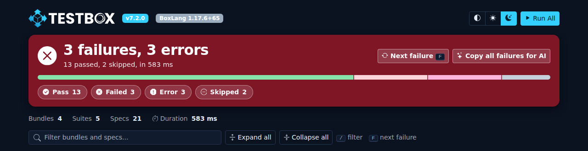<figcaption><p>The verdict banner with the totals, the proportion bar, the status filters and the shortcuts</p></figcaption></figure>

A green run stays calm and small:

<figure>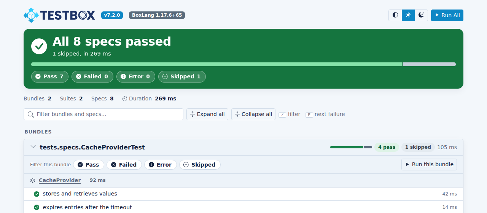<figcaption><p>All green</p></figcaption></figure>

If a whole bundle could not run, for example because `beforeAll()` threw, the report adds a dedicated alert **above** the verdict with the exception message, so it is never hidden inside a collapsed bundle:

<figure>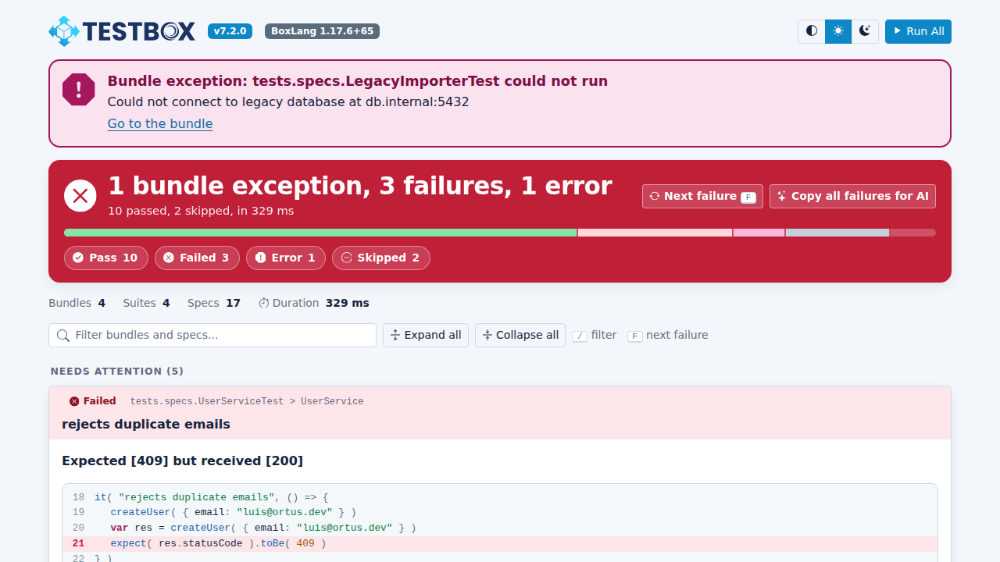<figcaption><p>A bundle that could not run</p></figcaption></figure>

## Find Your Way Around

### Jump To The Next Failure

Press **F** to move to the next failure or error. The page scrolls to it and highlights it. The **Next failure** button in the banner does the same thing.

<figure><figcaption><p>Press <code>F</code> to jump from failure to failure</p></figcaption></figure>

### Filter Everything

* Click a status chip (**Pass**, **Failed**, **Error**, **Skipped**) in the banner to filter the whole report. Click it again to clear it.
* Every bundle has its own status chips as well, so you can look at only the failed specs of one bundle.
* Press **/** to jump to the search box and type part of a bundle, suite or spec name.
* **Expand all** and **Collapse all** open or close every bundle. Bundles with problems start open.

<figure>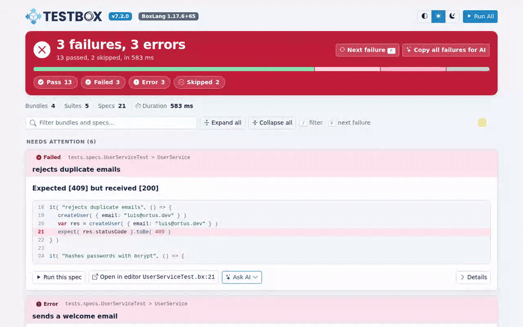<figcaption><p>Status filters and live text search</p></figcaption></figure>

<figure>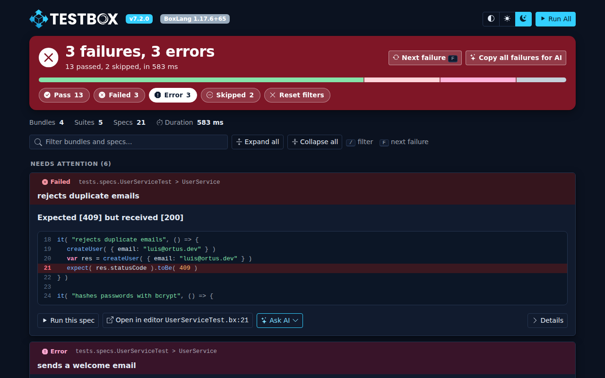<figcaption><p>Only the errors, with a Reset filters button to get everything back</p></figcaption></figure>

### Run It Again

Every bundle, suite and spec has a **Run** link. A run link is a plain link to the runner, so the address bar always holds what you are looking at and a browser refresh runs it again. **Run All** in the header runs the full suite.


A run link carries only the target you asked for (`testBundles`, `testSuites` or `testSpecs`). Every other runner option falls back to its default.


When something failed or errored, **Run Failed (N)** sits next to **Run All** and reruns only those specs. Its link lists the failed bundles and spec ids, built from the report itself, so the runner keeps no state: fix, click it again, repeat. See [Run All and Run Failed](README.md#run-all-and-run-failed).

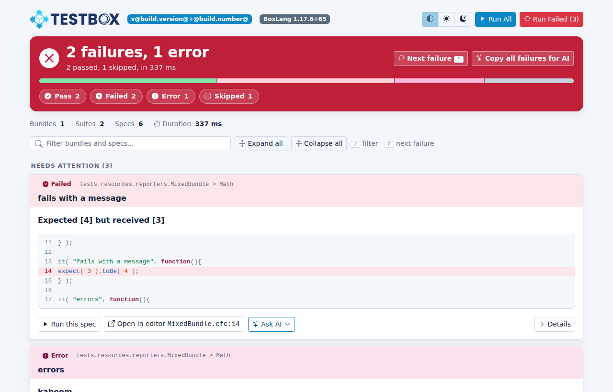

### Open In Your Editor

Failures link to the failing file and line in your editor. See [Open In Editor](README.md#open-in-editor) for the editors you can choose.

## Light And Dark

Use the switch in the header to pick **light**, **dark** or **system**. The choice is remembered in your browser and applied before the page paints, so there is no flash of the wrong theme.

<figure>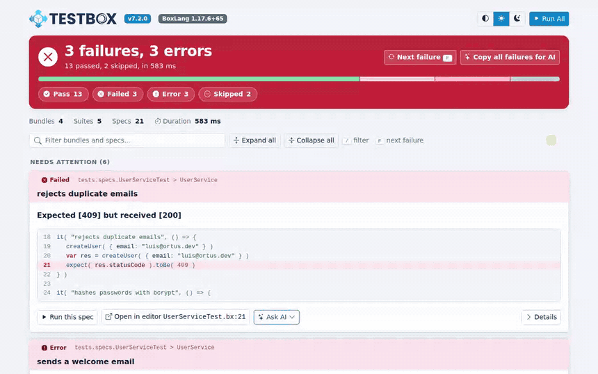<figcaption><p>Light and dark, on the TestBox palette</p></figcaption></figure>

## Ask AI

Every failure and error has an **Ask AI** menu. It builds a prompt that contains everything a person or an assistant needs: the spec, the status, the message, the code around the failing line, the first stack frames and the exact command to run only that spec again.

<figure><figcaption><p>Ask AI menu and prompt preview</p></figcaption></figure>

<figure>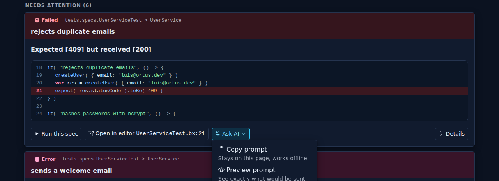<figcaption><p>The Ask AI menu</p></figcaption></figure>

| Menu item | What it does |
|-----------|--------------|
| **Copy prompt** | Copies the prompt to the clipboard. Stays on the page and works offline. |
| **Preview prompt** | Shows exactly what would be sent, before anything leaves the page. |
| **Open in ChatGPT / Claude** | Opens the provider with the prompt filled in. |
| **Copy for a coding agent** | Copies the failure as JSON in the [AgentReporter](README.md#agentreporter---token-efficient-output-for-ai-agents) format, for tools that read structured output. |

**Copy all failures for AI**, in the verdict banner, builds one prompt with every failure and error of the run.

<figure>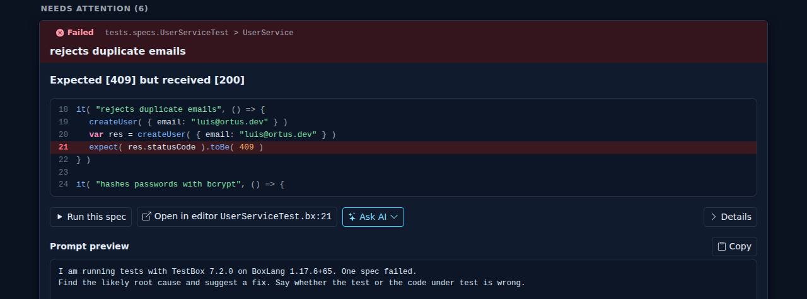<figcaption><p>Preview exactly what would be sent</p></figcaption></figure>

### Your Code Stays Yours Until You Say So

The prompt is built inside the page, in your browser. Nothing is sent anywhere until you click a provider, and the first time you do, the page tells you what happens next and waits for your confirmation:

<figure><figcaption><p>The first-use notice. Your choice is remembered in the browser.</p></figcaption></figure>

### Options

Ask AI is on by default. Configure it with reporter options:




```java
var testbox = new testbox.system.TestBox(
    bundles  = "tests.specs",
    reporter = {
        type    : "testbox.system.reports.SimpleReporter",
        options : {
            aiAssist       : true,
            aiContextLines : 8,
            aiStackFrames  : 5,
            aiProviders    : [
                { id : "acme", name : "Acme AI", url : "https://ai.acme.test/?p={prompt}" }
            ]
        }
    }
)
println( testbox.run() )
```





```cfscript
var testbox = new testbox.system.TestBox(
    bundles  = "tests.specs",
    reporter = {
        type    : "testbox.system.reports.SimpleReporter",
        options : {
            aiAssist       : true,
            aiContextLines : 8,
            aiStackFrames  : 5,
            aiProviders    : [
                { id : "acme", name : "Acme AI", url : "https://ai.acme.test/?p={prompt}" }
            ]
        }
    }
);
writeOutput( testbox.run() );
```




| Option | Default | Description |
|--------|---------|-------------|
| `aiAssist` | `true` | Shows the Ask AI menu. Set it to `false` to remove every Ask AI control and prompt from the page. You can also switch it off for one run with `?aiAssist=false`. |
| `aiProviders` | ChatGPT and Claude | An array of `{ id, name, url }`. The `url` must contain `{prompt}`, which is replaced by the URL-encoded prompt. Setting it replaces the defaults. |
| `aiContextLines` | `5` | Lines of code before and after the failing line in the prompt. |
| `aiStackFrames` | `8` | Stack frames in the prompt. Very long prompts are trimmed automatically to fit a URL. |
| `aiPrompt` | built in | A custom prompt template, see below. |
| `inlineImageMaxKB` | `2048` | Image attachments, such as failure screenshots, up to this size are embedded in the page as thumbnails. Larger ones stay links. `0` links every image. See [Attachments](../../browser-testing/attachments.md#screenshots-in-the-html-reports). |
| `urlParams` | none | A struct of request params, such as `editor` or `aiAssist`, for reports that you produce from code. See below. |

### Your Own Prompt

Use `aiPrompt` to ask for what your team needs. These tokens are replaced when the prompt is built:

| Token | Replaced with |
|-------|---------------|
| `{intro}` | The TestBox version, the engine and a one line description of the outcome |
| `{spec}` | The suite path and the spec name |
| `{status}` | `failed` or `error` |
| `{message}` | The failure or error message |
| `{code}` | The code around the failing line, fenced |
| `{stack}` | The first stack frames |
| `{rerun}` | The command that runs only this spec again |

```java
options : {
    aiPrompt : "{intro}

Spec: {spec} ({status})
{message}

{code}

Explain the cause in two sentences and propose a fix for the code, not the test.
Run it again with: {rerun}"
}
```

### Reports Produced From Code

In a web request the reporters read `editor` and `aiAssist` from the `url` scope. When you produce a report from code, for example with the BoxLang CLI, there is no `url` scope. Pass the same values with the `urlParams` option instead:

```java
options : { urlParams : { editor : "idea", aiAssist : "false" } }
```

## The Reporters

### Simple

Failures first, then every bundle with its suites and specs. The most complete view, and the default of the runners.

<figure><figcaption><p>Simple: a <em>Needs attention</em> section on top, every bundle below</p></figcaption></figure>

### Min

A compact page that lists only what needs attention, one line per failure, with the verdict and bundle exceptions above it.

<figure>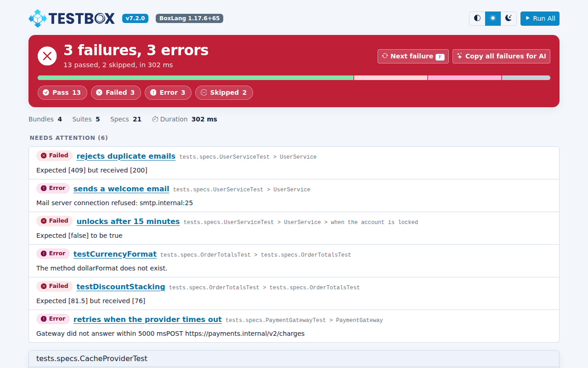<figcaption><p>Min: one line per failure</p></figcaption></figure>

### Dot

One dot per spec, grouped by bundle. Hover a dot for its name, click it to open the details, the code and Ask AI in a drawer. Filters dim the dots that do not match, so the shape of your run stays in place.

<figure>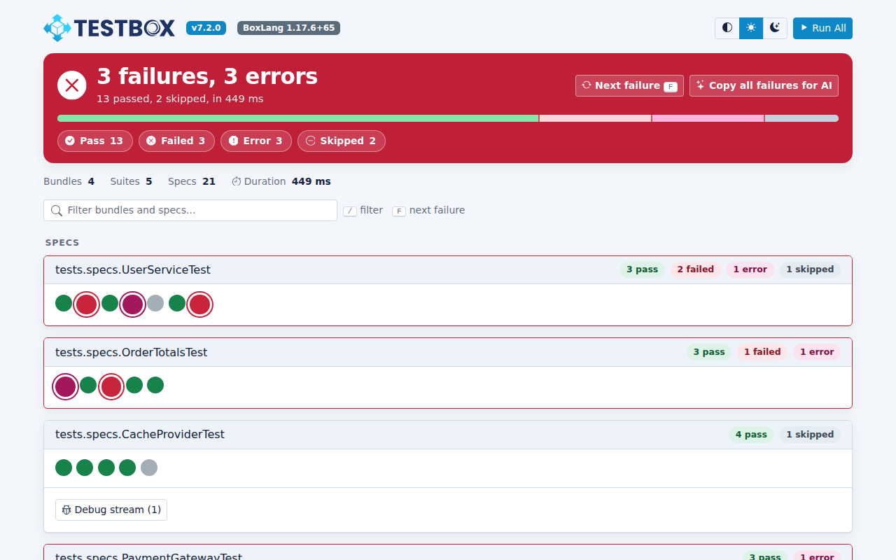<figcaption><p>Dot: your whole run at a glance</p></figcaption></figure>

<figure><figcaption><p>A click on a dot opens the details in a drawer</p></figcaption></figure>

<figure>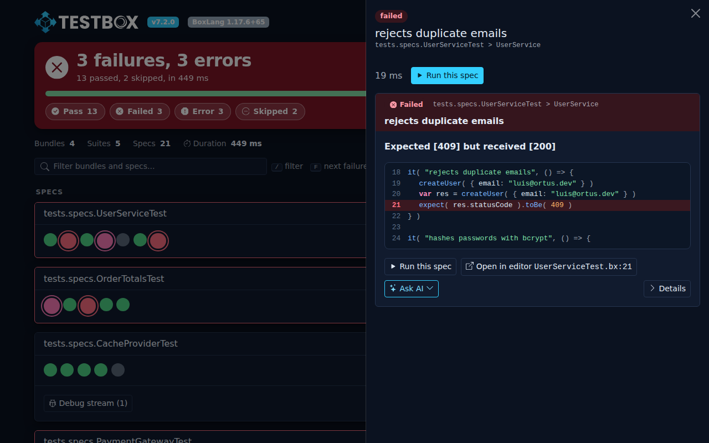<figcaption><p>The drawer shows the message, the code and Ask AI</p></figcaption></figure>

### Doc

Your suite rendered like documentation: a bundle navigation on the side and every suite and spec as readable text. A good fit for BDD suites that you want to read.

<figure>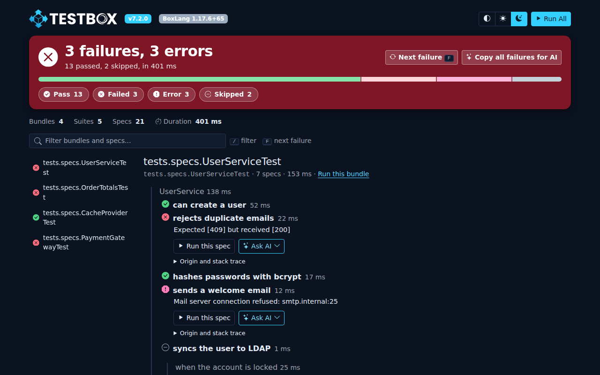<figcaption><p>Doc: bundle navigation and documentation-style output</p></figcaption></figure>

## On Every Screen

The reports are responsive, so you can open a CI artifact on your phone.

<figure>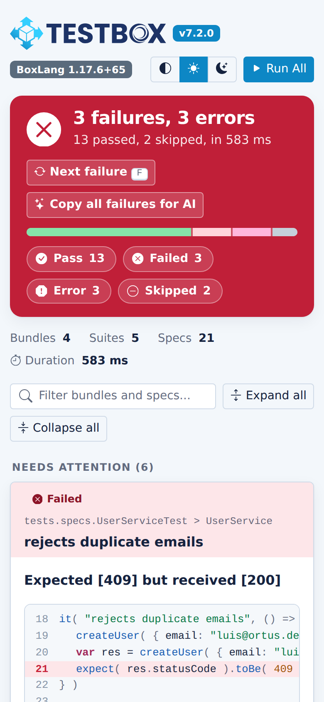<figcaption><p>Simple on a phone</p></figcaption></figure>

<figure>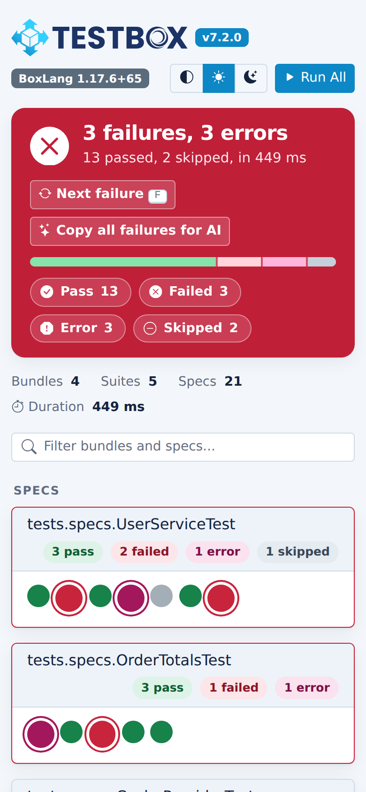<figcaption><p>Dot on a phone</p></figcaption></figure>

## Airgapped By Design

Everything a report needs, the styles, the icons, the scripts, the highlighter and the logo, is inlined in the page. A report is a single file that works offline, on a build server without internet, or attached to an email. The only time the page talks to the network is when you click an Ask AI provider.

Contributing to TestBox? The inlined front-end libraries (Bootstrap, Bootstrap Icons, Alpine and Prism) are built from `build/vendor` in the TestBox repository. Rebuild them with one command, and CI checks that the committed files match:

```bash
box run-script assets:update
```


**Changed in TestBox 7.2:** the `url.fullPage` switch was removed. An HTML reporter always returns a complete page. If you embedded a reporter in your own page, include the report in an `<iframe>` or use the `JSON` reporter and render the data yourself.

