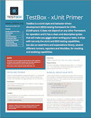

# Overview

TestBox is a next generation testing framework for ColdFusion \(CFML\) that is based on BDD \(Behavior Driven Development\) for providing a clean obvious syntax for writing tests. It contains not only a testing framework, runner, assertions, mocking/stubbing and expectations library. It also supports xUnit style of testing with MXUnit compatibilities.


**Important** TestBox is a standalone testing package and is meant to be used with any ColdFusion \(CFML\) application, framework or library. IT IS NOT ONLY FOR COLDBOX APPLICATIONS.


## Useful Resources

* [Approaches to Mocking](http://www.onjava.com/pub/a/onjava/2004/02/11/mocks.html)
* [Wikipedia Mock Objects](http://en.wikipedia.org/wiki/Mock_object)
* [Using mock objects for complex unit tests IBM developerWorks](http://www-128.ibm.com/developerworks/rational/library/oct06/pollice/index.html)
* [Unit testing with mock objects IBM developerWorks](http://www.ibm.com/developerworks/library/j-mocktest.html)
* [Emergent Design by Scott Bain](http://www.netobjectives.com/emergent-design-evolutionary-nature-professional-software-development)
* [Mocks Aren't Stubs by Martin Fowler](http://martinfowler.com/articles/mocksArentStubs.html)

## Ref Cards

Our RefCards will get you up and running in no time.

## BDD RefCard

## xUnit RefCard

