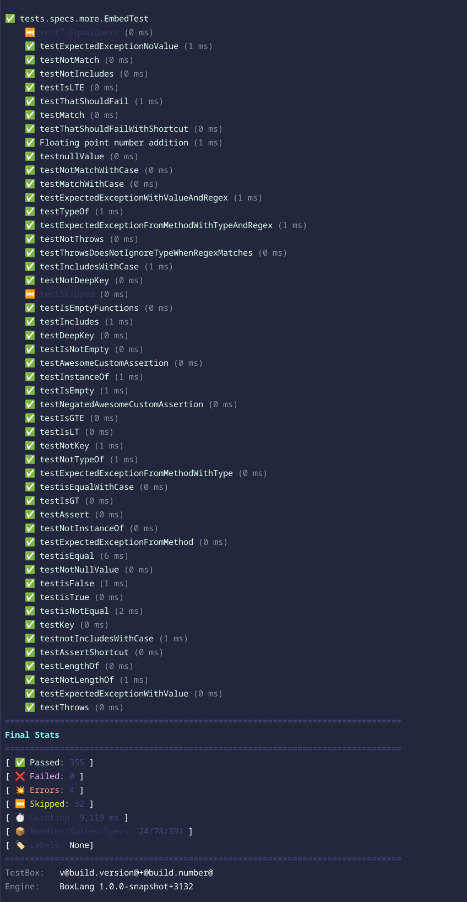

# BoxLang CLI Runner

TestBox ships with a BoxLang CLI runner for Linux/Mac and Windows. This will allow you to execute your tests from the CLI and, in the future, via VSCode easily and extremely fast. It can also execute and stream the executions to see the testing progress when running in `verbose` mode.   The runner can also execute specs/tests written in CFML or BoxLang in the BoxLang runtime.

<figure><figcaption></figcaption></figure>


Please note that this is a BoxLang-only feature.


BoxLang allows you to build web applications, CLI, serverless, Android, and more. You can use this runner to test each environment. However, please note that if you will be testing web servers from the CLI only, you will need to install the web support module into the Operating System runtime.

### Web Server Testing

If you want to test from the CLI your web application with no web server, then you will need to install the `bx-web-support` module into the CLI.  _Remember that BoxLang is multi-runtime, and you cannot only build web applications but CLI or OS-based applications._

```bash
// BoxLang OS Binary
install-bx-module bx-web-support
```

This will add web support to the CLI (BIFS, components, etc.) and a mock HTTP server so you can do full life-cycle testing from the CLI, like running your app on a web server. This runner does not require a web server to function; thus, if you are building a web app, you will need this module if you still want to execute your tests in the CLI Runtime.


If you are building exclusively a web application, we suggest you use the [CommandBox runner](commandbox-runner.md) which will call your runner via HTTP from the CLI.  You can also just use the [Web Runner](test-runner.md).


### Script Locations

The scripts are located in the following directory: `/testbox/` from the TestBox installation package.

* `run` - For Linux/Mac
* `run.bat` - For Windows

This is the entry point for executing tests at the CLI level. Please note that the test execution does NOT involve a web server. This is for pure CLI testing.

### Examples:

The runner must be run from the root of your BoxLang project:

#### Mac/Linux

```bash
./testbox/run
./testbox/run my.bundle
./testbox/run --directory=tests.specs
./testbox/run --bundles=my.bundle
```

#### Windows Examples:

```bash
./testbox/run.bat
./testbox/run.bat my.bundle
./testbox/run.bat --directory=tests.specs
./testbox/run.bat --bundles=my.bundle
```

### Execution Options

* `--bundles` A list of test bundles to run, defaults to \*, ex: path.to.bundle1,path.to.bundle2, . Mutually exclusive with --directory
* `--bundles-pattern` A pattern to match test bundles defaults to "`*Spec*.cfc|*Test*.cfc|*Spec*.bx|*Test*.bx`"
* `--directory` A list of directories to look for tests to execute. Please use dot-notation, not absolute notation. Mutually exclusive with `--bundles`. Ex: `tests.specs` Defaults to `tests.specs`
* `--recurse` : Recurse into subdirectories, defaults to true
* `--eager-failure` : Fail fast, defaults to false
* `--verbose` : Verbose output defaults to false. This will stream the output of the status of the tests as they run.

### Reporting Options

* `--reporter` The reporter to use.
* `--reportpath` : The path to write the report file defaults to the `/tests/results` folder by convention
* `--properties-summary` : Generate a properties file with the summary of the test results, defaults to true.
* `--properties-filename` : The name of the properties file to generate defaults to TEST.properties
* `--write-report` : Write the report to a file in the report path folder, defaults to true
* `--write-json-report` : Write the report as JSON alongside the requested report, defaults to false
* `--write-visualizer` : Write the visualizer to a file in the report path folder, defaults to false

### Runner Options

You can also pass options to the selected runner by using the following convention:

```bash
--runner-{option}=value
```

This will pass a struct of options to the runners once it runs.

### Filtering Options

* `--labels` : A list of labels to use in the execution.
* `--excludes` : A list of labels to exclude in the execution.
* `--filter-bundles` : A list of bundles to filter by, defaults to \*
* `--filter-suites` : A list of suites to filter by, defaults to \*
* `--filter-specs` : A list of test names or spec names to filter by, defaults to \*
