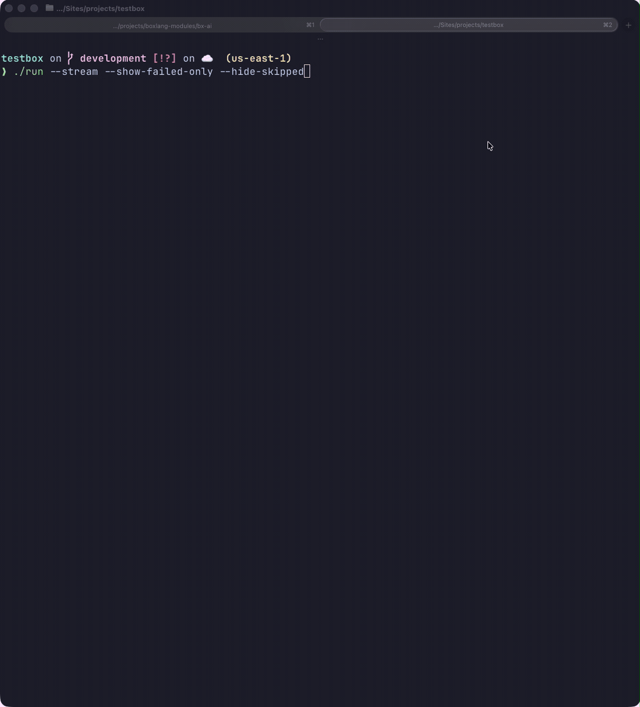

# BoxLang CLI Runner

TestBox ships with a BoxLang CLI runner for Linux/Mac and Windows. Run your entire test suite — or individual bundles — directly from the terminal with rich, colored output, real-time streaming, dry runs, and detailed performance analysis.

<figure><figcaption></figcaption></figure>


The BoxLang CLI runner is a BoxLang-only feature. It runs tests in the BoxLang OS runtime, not inside a web server.


BoxLang allows you to build web applications, CLI, serverless, Android, and more. You can use this runner to test each environment. However, please note that if you will be testing web apps from the CLI, you will need to install the web support module into the OS runtime.

### Web Server Testing

If you want to test your web application from the CLI without a running web server, install the `bx-web-support` module into the BoxLang OS runtime. This adds web BIFs, components, and a mock HTTP server so you can do full life-cycle testing purely from the CLI.

```bash
install-bx-module bx-web-support
```


If you are building exclusively a web application, we suggest you use the [CommandBox runner](commandbox-runner.md) which calls your runner via HTTP, or the [TestBox RUN IDE](testbox-run-ide.md) for a browser-based experience.


### Application.bx Auto-Load

The BoxLang runner **automatically attempts to load your `Application.bx` mappings** from the project root before running any specs. This means custom path mappings, datasources, and settings defined in `Application.bx` are available to your tests without any extra configuration — bringing the CLI experience much closer to a full web server environment.

### Script Locations

The runner scripts live in `testbox/` inside your TestBox installation:

* `run` — Linux / macOS
* `run.bat` — Windows

The runner must be executed from the **root** of your BoxLang project.

### Examples

#### Mac/Linux

```bash
./testbox/run
./testbox/run my.bundle
./testbox/run --directory=tests.specs
./testbox/run --bundles=my.bundle
```

#### Windows

```bash
./testbox/run.bat
./testbox/run.bat my.bundle
./testbox/run.bat --directory=tests.specs
./testbox/run.bat --bundles=my.bundle
```

---

## Execution Options

| Option | Description | Default |
|--------|-------------|---------|
| `--bundles` | Dot-notation list of test bundles to run. Mutually exclusive with `--directory`. | `*` |
| `--bundles-pattern` | Glob pattern for discovering bundles. | `*Spec*.cfc\|*Test*.cfc\|*Spec*.bx\|*Test*.bx` |
| `--directory` | Dot-notation directory to scan for tests. Mutually exclusive with `--bundles`. | `tests.specs` |
| `--recurse` | Recurse into sub-directories. | `true` |
| `--eager-failure` | Stop the run on the first failure. | `false` |
| `--verbose` | Show all spec results as they run. | `false` |

---

## 🌊 Streaming (Real-Time Output)

The `--stream` flag activates real-time output, pushing each spec result to the terminal as it completes rather than buffering until the suite finishes.

<figure><figcaption></figcaption></figure>

```bash
./testbox/run --stream
./testbox/run --directory=tests.specs --stream
```

<figure><figcaption></figcaption></figure>


Streaming is especially useful in CI environments where you need live progress rather than waiting for the full suite to finish before seeing any output.


---

## 🔍 Dry Run & Spec Discovery

The `--dry-run` flag discovers and reports every spec that **would** be executed — without actually running any spec closures. Use it to audit coverage, validate label filters, and build test inventories before committing to a full run.

<figure><figcaption></figcaption></figure>

```bash
# Formatted text output
./testbox/run --dry-run

# Raw JSON output — ideal for CI tools and external scripts
./testbox/run --dry-run=json
./testbox/run --dry-run=json --bundles=tests.specs.MySpec | jq .
```

The output lists every suite and spec that would be executed, along with their labels and any skip reasons.


Dry run respects **all** the same filtering options as a normal run: `--labels`, `--bundles`, `--directory`, `--filter-suites`, `--filter-specs`, etc.


For programmatic dry runs from BoxLang code, see [Dry Run & Spec Discovery](../../digging-deeper/dry-run.md).

---

## 🎯 Output & Focus Options (New in 7.0)

### `--show-failed-only`

Focus your terminal output exclusively on failures and errors, hiding all passing and skipped specs:

```bash
./testbox/run --show-failed-only
```

### `--show-passed` / `--show-skipped`

Fine-grained control over which result types appear in the output:

```bash
./testbox/run --show-passed=false    # hide passing specs
./testbox/run --show-skipped=false   # hide skipped specs
```

### `--stacktrace`

Control how much stack trace detail is shown for failures and exceptions:

```bash
./testbox/run --stacktrace=short   # default — condensed first frame only
./testbox/run --stacktrace=full    # complete Java/BoxLang stack trace
```

### `--max-failures`

Abort the run after a set number of failures — useful for keeping CI output manageable:

```bash
./testbox/run --max-failures=10
```

### Performance Analysis: `--slow-threshold-ms` & `--top-slowest`

Identify slow specs and surface them at the end of the run:

```bash
# Flag any spec taking longer than 500 ms as slow
./testbox/run --slow-threshold-ms=500

# Print a summary of the 5 slowest specs after the run
./testbox/run --top-slowest=5
```

### Combining Output Options

```bash
./testbox/run --show-failed-only --stacktrace=short --max-failures=5 --top-slowest=3
```

---

## Reporting Options

| Option | Description | Default |
|--------|-------------|---------|
| `--reporter` | The reporter to use. | `text` |
| `--reportpath` | Directory for report files. | `/tests/results` |
| `--properties-summary` | Generate a `.properties` summary file. | `true` |
| `--properties-filename` | Name for the properties file. | `TEST.properties` |
| `--write-report` | Write the report to a file. | `true` |
| `--write-json-report` | Write a JSON report alongside the main report. | `false` |
| `--write-visualizer` | Write the test visualizer to the report directory. | `false` |

---

## Runner Options

Pass arbitrary options directly through to the selected runner:

```bash
--runner-{option}=value
```

---

## Filtering Options

| Option | Description |
|--------|-------------|
| `--labels` | Only run specs/suites with these labels. |
| `--excludes` | Skip specs/suites with these labels. |
| `--filter-bundles` | Limit execution to these bundle names. |
| `--filter-suites` | Limit execution to these suite names. Direct name matching is supported at any nesting depth. |
| `--filter-specs` | Limit execution to these spec names. |


Suite filtering (`--filter-suites`) performs **direct name matching** at any nesting depth — if a suite's name exactly matches the filter value it will always be included regardless of how deeply it is nested.

