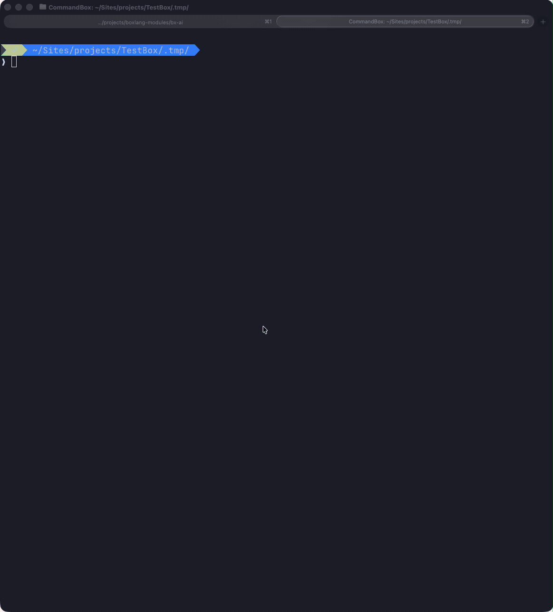
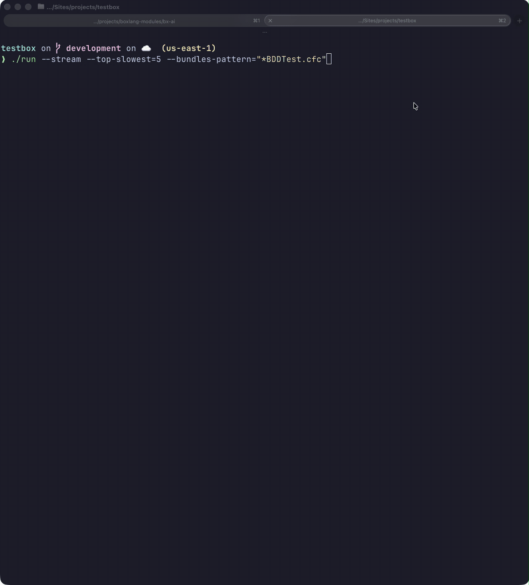

# Streaming Runner

TestBox 7 introduces a brand-new **StreamingRunner** that pushes test results to the client as each spec completes via **Server-Sent Events (SSE)**. You no longer have to wait for the entire suite to finish before seeing results — each spec result is streamed in real time. This opens up powerful workflows for CI pipelines, large test suites, and browser-based IDEs where immediate feedback is critical.

<figure><figcaption>Spec results arrive in the terminal as each test completes</figcaption></figure>

## Where Streaming Is Used

The `StreamingRunner` is the engine behind two separate streaming experiences:

| Consumer | How to activate |
|----------|----------------|
| **[TestBox RUN IDE](testbox-run-ide.md)** | Open `bx/tests/index.bxm` in your browser — streaming is always on |
| **CommandBox CLI** | `testbox run --streaming` |
| **BoxLang CLI Runner** | `./testbox/run --stream` |

---

## Programmatic Usage

`testbox.system.runners.StreamingRunner` can be wired into any SSE-capable HTTP endpoint:

```javascript
component {

    function streamTests( event, rc, prc ) {
        // Required SSE headers
        event.setHTTPHeader( name = "Content-Type",  value = "text/event-stream" );
        event.setHTTPHeader( name = "Cache-Control", value = "no-cache" );
        event.setHTTPHeader( name = "Connection",    value = "keep-alive" );

        new testbox.system.runners.StreamingRunner(
            bundles  = "tests.specs",
            options  = {},
            reporter = "text"
        ).run();
    }

}
```

### BoxLang Example

In a BoxLang handler or script:

```javascript
class {

    function streamTests( event, rc, prc ) {
        event.setHTTPHeader( name = "Content-Type",  value = "text/event-stream" )
        event.setHTTPHeader( name = "Cache-Control", value = "no-cache" )

        new testbox.system.runners.StreamingRunner(
            bundles = "tests.specs",
            options = {}
        ).run()
    }

}
```

---

## CLI Streaming

### CommandBox (`testbox run --streaming`)

<figure><figcaption></figcaption></figure>

```bash
testbox run --streaming

# Include all passing specs in the live feed
testbox run --streaming --verbose
```

### BoxLang CLI (`./testbox/run --stream`)

<figure><figcaption></figcaption></figure>

```bash
./testbox/run --stream
./testbox/run --directory=tests.specs --stream
```

See the [BoxLang CLI Runner](boxlang-cli-runner.md) for the full set of output-control options (`--show-failed-only`, `--stacktrace`, etc.) that work alongside `--stream`.

---

## SSE Event Format

Each spec result is emitted as an SSE event with the following structure:

```
event: spec
data: {"name":"it should do something","status":"pass","durationMs":12,"suitePath":"My Suite > My Sub Suite"}

event: spec
data: {"name":"it should fail","status":"fail","durationMs":5,"message":"Expected true to be false"}

event: done
data: {"totalPass":42,"totalFail":1,"totalError":0,"totalSkipped":3,"totalDuration":1402}
```

Event types:

| Event | Description |
|-------|-------------|
| `bundle-start` | A new bundle begins execution |
| `bundle-end` | A bundle has finished; includes bundle-level stats |
| `suite-start` | A suite begins |
| `suite-end` | A suite completes |
| `spec` | A single spec result (pass/fail/error/skipped) |
| `done` | Full run complete; includes aggregate stats |


The SSE format is consumed natively by the [TestBox RUN IDE](testbox-run-ide.md) and by the streaming renderers in both CLI runners. You can also consume it from any SSE-capable HTTP client.

