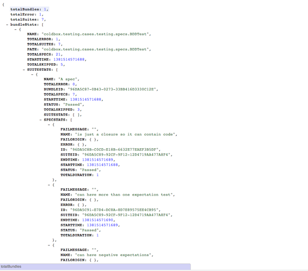
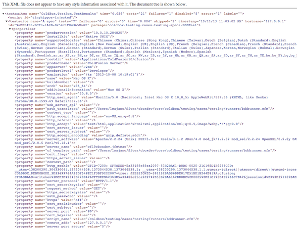
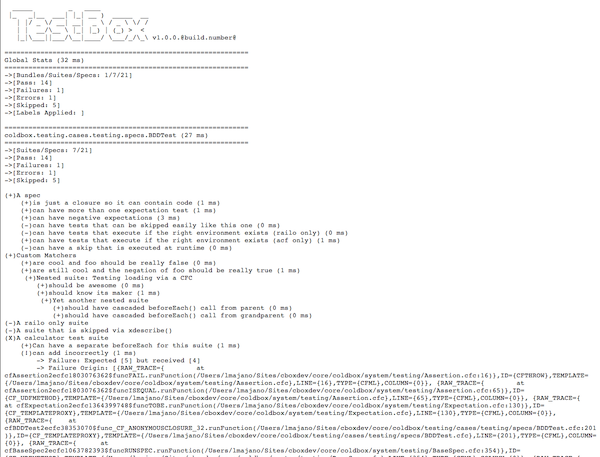

# Reporters

TestBox comes also with a nice plethora of reporters:

* `ANTJunit` : A specific variant of JUnit XML that works with the ANT junitreport task
* `Codexwiki` : Produces MediaWiki syntax for usage in Codex Wiki
* `Console` : Sends report to console
* `Doc` : Builds semantic HTML to produce nice documentation
* `Dot` : Builds an awesome dot report
* `JSON` : Builds a report into JSON
* `JUnit` : Builds a JUnit compliant report
* `Min` : A minimalistic view of your test reports
* `MinText` : A minimalistic text report
* `Raw` : Returns the raw structure representation of the testing results
* `Simple` : A basic HTML reporter
* `Tap` : A test anything protocol reporter
* `Text` : Back to the 80's with an awesome text report
* `XML` : Builds yet another XML testing report
* `Tap` : A test anything protocol reporter

To use a specific reporter append the `reporter` variable to the `url` string. ex `&reporter=Text` or set it in your `runner.cfm`

## Open In Editor (Simple)&#x20;

The `simple` reporter allows you to set a code editor of choice so it can create links for stack traces and tag contexts.  It will then open your exceptions and traces in the right editor at the right line number. &#x20;


The default editor is `vscode`


To change the editor of choice use the `url.editor` parameter which you can send in via the url or set it in your `runner.cfm`

```markup
<cfsetting showDebugOutput="false">
<!--- Executes all tests in the 'specs' folder with simple reporter by default --->
<cfparam name="url.reporter" 			default="simple">
<cfparam name="url.directory" 			default="tests.specs">
<cfparam name="url.recurse" 			default="true" type="boolean">
<cfparam name="url.bundles" 			default="">
<cfparam name="url.labels" 				default="">
<cfparam name="url.excludes" 			default="">
<cfparam name="url.reportpath" 			default="#expandPath( "/tests/results" )#">
<cfparam name="url.propertiesFilename" 	default="TEST.properties">
<cfparam name="url.propertiesSummary" 	default="false" type="boolean">
<cfparam name="url.editor" 				default="vscode">

<!--- Include the TestBox HTML Runner --->
<cfinclude template="/testbox/system/runners/HTMLRunner.cfm" >

```

 (2).png>)

.png>)

### Available Editors

The available editors are:

* atom
* emacs
* espresso
* idea
* macvim
* sublime
* textmate
* vscode
* vscode-insiders

## `Images`










