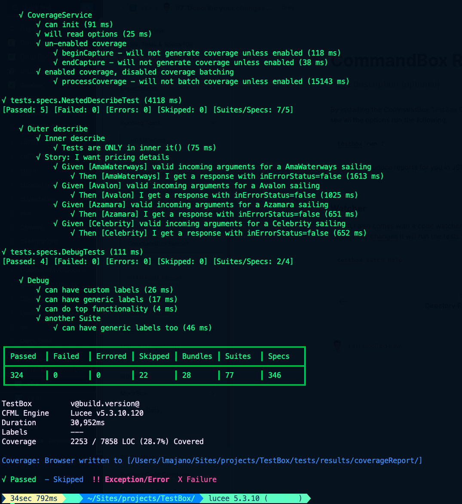

# CommandBox Runner

By installing the CommandBox [TestBox CLI](../../getting-started/installing-testbox/) you can get access to our CommandBox runner.  The CommandBox runner leverages the HTTP(s) protocol to test against any server.  By default it will inspect your `box.json` for a `default` runner or try to connect to `/tests/runner.cfm` by default.&#x20;

To see all the running options run the following in your CLI shell:

```bash
testbox run help

testbox run directory="tests.specs" outputFormats="json,junit,html"

testbox run runner="http://myremoteapp.com/tests/runner.cfm"
```

It can also produce reports for you in JSON, HTML, and JUNIT.

<figure><figcaption></figcaption></figure>

## Watcher

The CLI also comes with a code watcher and runner.  It will watch any paths for you, and if it detects any changes, it will run the tests you want.

```bash
testbox watch help
```
