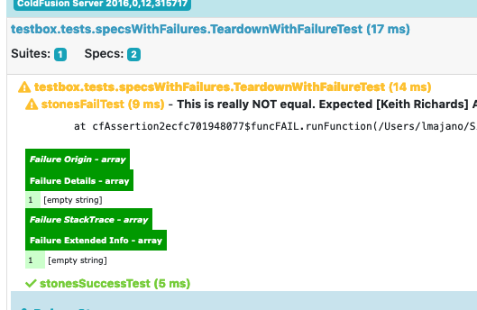
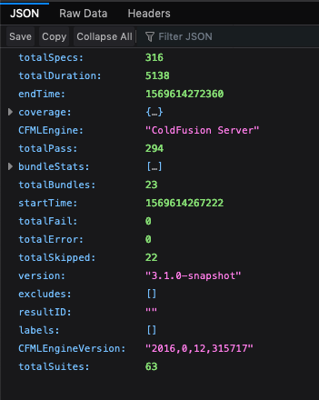

# What's New With 3.1.0

## Major Features

### Focused Suites and Specs

This was asked for a long time ago and finally we can oblige.  You can now prefix any of the suite and spec methods with the letter `f` and they will be focused.  Meaning, ONLY those suites or specs will be executed.

* `fit(), fthen()` - Spec Methods
* `fdescribe(), fscenario(), fstory(), ffeature(), fgiven(), fwhen()` - Suite Methods

This is great if you ONLY want certain things to execute instead of the `x` prefix which was used to EXCLUDE specs and suites.


```javascript
function run( testResults, testBox ){
	// all your suites go here.
	describe( "My First Suite", function(){

		it( "A Spec that should not run", function(){
			fail( 'implement' );
		});

		it( "A Spec that should not run", function(){
			fail( 'implement' );
		});

		fit( "This should execute", function(){
			expect( 1 ).toBeTrue();
		});

		it( "A Spec that should not run", function(){
			fail( 'implement' );
		});

		fit( "This should execute as well", function(){
			expect( 1 ).toBeTrue();
		});

		fdescribe( "All specs here should run", function(){

			it( "should run", function(){

			});
			it( "should run", function(){

			});
			it( "should run", function(){

			});
		} );

		describe( "All specs here should NOT run", function(){

			it( "A Spec that should not run", function(){
				fail( 'implement' );
			});

			it( "A Spec that should not run", function(){
				fail( 'implement' );
			});

			it( "A Spec that should not run", function(){
				fail( 'implement' );
			});

		} );

	});

	fdescribe( "My Focused Suite", function(){

		it( "This should execute", function(){
			expect( 1 ).toBeTrue();
		});

		describe( "All specs here should run", function(){

			it( "should run", function(){

			});
			it( "should run", function(){

			});
			it( "should run", function(){

			});
		} );

		xdescribe( "skipped suites", function(){

			it( "A Spec that should not run", function(){
				fail( 'implement' );
			});

			it( "A Spec that should not run", function(){
				fail( 'implement' );
			});

			it( "A Spec that should not run", function(){
				fail( 'implement' );
			});

		} );

	});
```


Here are the results:


### `toHaveKey()` can now work with key lists

How many times did you want to check if a struct had ALL the keys or NO keys at all.  Well, now you can. You can pass a list of keys into the `toHaveKey()` expectation and we will make sure your structure has ALL the keys in it.

```javascript
var s = {
	"data" : {},
	"error" : {},
	"name" : {},
	"age" : 0
};

expect( s ).toHaveKey( "error" );
expect( s ).notToHaveKey( "luis" );

// Multiple
expect( s ).toHaveKey( "data,error,name,age" );
expect( function(){
	expect( s ).toHaveKey( "data,error,name,age2" );
}).toThrow();
expect( s ).notToHaveKey( "luis,joe,tom" );
expect( function(){
	expect( s ).toHaveKey( "luis,joe,data" );
}).toThrow();
```

### `fail()` Improvements

You can now pass in a detail to the fail messages that can be used to track exception details, stacktraces, extended info and much more. Sometimes, this can be a life-saver when dealing with `toThrow()` expectations:

```javascript
/**
 * Fail an assertion
 *
 * @message The message to fail with.
 * @detail The detail to fail with.
 */
function fail( message = "", detail = "" ){
	variables.assert.fail( argumentCollection = arguments );
}
```

Which is exactly what we did.  The catching of expected exceptions now pass in the exact stacktrace where they failed instead of the nested exception. Which goes nicely into our next major improvement.

### Nested Exceptions

We all hate them and not easy to track.  In this release we at least try to add more debugging on the results by introducing the following new keys and output on the reporters:

* `failDetail`
* `failExtendedInfo`
* `failStacktrace`



### CFML Engine/Version Detection


The reporters know will output the CFML engine the report is executed on.  Also, the raw json/xml reporters will also report back the CFML engine and version.



## Release Notes

### Bugs

* \[[TESTBOX-251](https://ortussolutions.atlassian.net/browse/TESTBOX-251)\] - Scripts don't output if `runner.cfm` has `enableCFoutputOnly` set to true
* \[[TESTBOX-252](https://ortussolutions.atlassian.net/browse/TESTBOX-252)\] - JSON,xml,Junit, Ant reporters fails for integration tests with cfhtmlhead and cfheader
* \[[TESTBOX-257](https://ortussolutions.atlassian.net/browse/TESTBOX-257)\] - Update build process to upload the right version assets

### New Features

* \[[TESTBOX-255](https://ortussolutions.atlassian.net/browse/TESTBOX-255)\] - Added new spec stats to track nested exceptions: failDetail, failExtendedInfo, failStacktrace
* \[[TESTBOX-256](https://ortussolutions.atlassian.net/browse/TESTBOX-256)\] - Add a detail argument to the `fail()` method to allow for more in-depth tracking of failures, especially when using the ```toThrow()``` expectation
* \[[TESTBOX-258](https://ortussolutions.atlassian.net/browse/TESTBOX-258)\] - Added `CFMLEngine` and `CFMLEngineVersion` to results memento so any consumer can display this information
* \[[TESTBOX-253](https://ortussolutions.atlassian.net/browse/TESTBOX-253)\] - Display the CFML engine in use when using the simple reporter
* \[[TESTBOX-198](https://ortussolutions.atlassian.net/browse/TESTBOX-198)\] - Add support to fit, fdescribe, fscenario,fwhen, fgiven, fstory, ffeature, fthen

### Improvements

* \[[TESTBOX-254](https://ortussolutions.atlassian.net/browse/TESTBOX-254)\] - check if fail origin is an array in case internal TestBox borks out in all the reporters
* \[[TESTBOX-259](https://ortussolutions.atlassian.net/browse/TESTBOX-259)\] - Turn off code coverage when clicking a link in the HTML reporter
* \[[TESTBOX-260](https://ortussolutions.atlassian.net/browse/TESTBOX-260)\] - `toHaveKey()` now accepts a list of keys that MUST or MUST NOT exist in the collection

