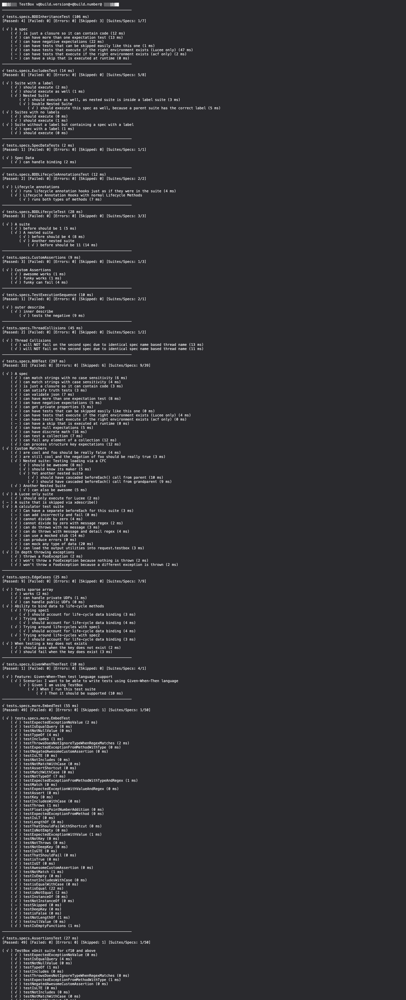
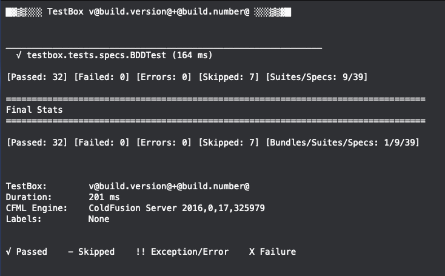

# What's New With 4.3.0

TestBox v4.3.0 includes several new features and bug fixes.  Here are the release notes and major areas of improvements.

## New Text Reporters

This release has revamped the `text` and `mintext` reporters.  Check them out by adding `reporter=text` or `reporter=mintext` when running your tests.

## Editor URL Integrations

The simple reporter has been updated to add editor opening integration.  Now all the tag contexts and traces are links and will open in your favorite IDE of choice.  You can control the editor by using the `url.editor` parameter in the URL or via your runner.

 (1).png>)

## Release Notes

### Bugs

* [TESTBOX-299](https://ortussolutions.atlassian.net/browse/TESTBOX-299) Bug in XML-escaping in JUnit reporters
* [TESTBOX-298](https://ortussolutions.atlassian.net/browse/TESTBOX-298) min reporter is making assumptions that url.directory will exist
* [TESTBOX-297](https://ortussolutions.atlassian.net/browse/TESTBOX-297) code coverage QoQ doesn't account for nulls in sum()
* [TESTBOX-287](https://ortussolutions.atlassian.net/browse/TESTBOX-287) Simple Reporter doesn't show the Test that fails but the assertion in the origin

### Improvements

* [TESTBOX-305](https://ortussolutions.atlassian.net/browse/TESTBOX-305) Show the type of the actual pass into instance type expectations
* [TESTBOX-300](https://ortussolutions.atlassian.net/browse/TESTBOX-300) Improvement: shift test summary to the bottom of MinTextReporter
* [TESTBOX-295](https://ortussolutions.atlassian.net/browse/TESTBOX-295) Update the junit and antjunit reports to NOT include supported locales due to the size of the packet

### New Features

* [TESTBOX-309](https://ortussolutions.atlassian.net/browse/TESTBOX-309) Reworked simple reporter to better visualize fail origins and tag contexts.
* [TESTBOX-308](https://ortussolutions.atlassian.net/browse/TESTBOX-308) Simple reporter now has editor integrations to open failure and error stacks in your editor
* [TESTBOX-307](https://ortussolutions.atlassian.net/browse/TESTBOX-307) New text and min text reporters to improve visualizations
* [TESTBOX-306](https://ortussolutions.atlassian.net/browse/TESTBOX-306) Test failures triggered in `beforeAll` are counted incorrectly
