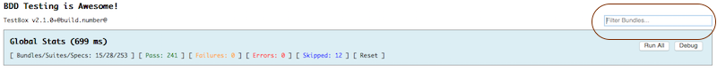

# What's New With 2.1.0

TestBox 2.1.0 is a minor release with some great new functionality and tons of fixes.

## Release Notes

Bugs Fixed

* \[[TESTBOX-96](https://ortussolutions.atlassian.net/browse/TESTBOX-96)\] - isEqual on Query fails when queries are equal
* \[[TESTBOX-97](https://ortussolutions.atlassian.net/browse/TESTBOX-97)\] - equalize fails on struct/objects/arrays when null values exist within them
* \[[TESTBOX-98](https://ortussolutions.atlassian.net/browse/TESTBOX-98)\] - Floating Point Number isEqual Fails
* \[[TESTBOX-100](https://ortussolutions.atlassian.net/browse/TESTBOX-100)\] - Specs with the same name cause thread name exceptions when using async
* \[[TESTBOX-101](https://ortussolutions.atlassian.net/browse/TESTBOX-101)\] - Download file has "samples" instead of "tests" directory
* \[[TESTBOX-102](https://ortussolutions.atlassian.net/browse/TESTBOX-102)\] - tobe\(\) cannot handle sparse arrays on Adobe CF
* \[[TESTBOX-103](https://ortussolutions.atlassian.net/browse/TESTBOX-103)\] - xUnit compatibility CF9 broken due to isClosure\(\) being utilized
* \[[TESTBOX-105](https://ortussolutions.atlassian.net/browse/TESTBOX-105)\] - skip closures get more metadata arguments when being executed.
* \[[TESTBOX-115](https://ortussolutions.atlassian.net/browse/TESTBOX-115)\] - testbox errors when using complete null support in railo

###  Improvement

* \[[TESTBOX-40](https://ortussolutions.atlassian.net/browse/TESTBOX-40)\] - Have debug\(\) include information about where it came from
* \[[TESTBOX-95](https://ortussolutions.atlassian.net/browse/TESTBOX-95)\] - remove extra whitespace in text reporter
* \[[TESTBOX-110](https://ortussolutions.atlassian.net/browse/TESTBOX-110)\] - Remove CF7,8 incompatibilities
* \[[TESTBOX-118](https://ortussolutions.atlassian.net/browse/TESTBOX-118)\] - ColdFusion 11 cfinclude compatibilities

###  New Feature

* \[[TESTBOX-106](https://ortussolutions.atlassian.net/browse/TESTBOX-106)\] - BDD run\(\) method now receive the TestResults argument for usage in their definitions.
* \[[TESTBOX-107](https://ortussolutions.atlassian.net/browse/TESTBOX-107)\] - BDD runner and specs receive reference to the TestBox calling class via the run\(\) method
* \[[TESTBOX-108](https://ortussolutions.atlassian.net/browse/TESTBOX-108)\] - Update the apidocs with our new DocBox skin
* \[[TESTBOX-109](https://ortussolutions.atlassian.net/browse/TESTBOX-109)\] - Debug labels and telemetry additions
* \[[TESTBOX-112](https://ortussolutions.atlassian.net/browse/TESTBOX-112)\] - Add "top" attribute to debug method
* \[[TESTBOX-114](https://ortussolutions.atlassian.net/browse/TESTBOX-114)\] - HTMLRunner add big request timeout setting to avoid server cut offs
* \[[TESTBOX-116](https://ortussolutions.atlassian.net/browse/TESTBOX-116)\] - have expectations assertions return the expectation to allow chaining
* \[[TESTBOX-117](https://ortussolutions.atlassian.net/browse/TESTBOX-117)\] - Simple reporter includes now a test bundle filter
* \[[TESTBOX-119](https://ortussolutions.atlassian.net/browse/TESTBOX-119)\] - New lifecycle method: aroundEach\(\) so you can do a full AOP advice on any spec

## Global Enhancements

* Better whitespace management on text enabled reporting
* ColdFusion 11 compatibilities
* ColdFusion 9 support on xUnit and Assertions
* New searchable API Docs with new skin: [http://apidocs.ortussolutions.com/testbox/2.1.0/index.html](http://apidocs.ortussolutions.com/testbox/2.1.0/index.html)
* HTML Runners now have a high request timeout for long-lasting tests

## Debugging Enhancements

TestBox's `debug()` method has been enhanced to provide greater messages and telemetry. You can even control the depth of the dumps of each of the debugged data as it is sent. Here is the new signature:

```javascript
/**
* Debug some information into the TestBox debugger array buffer
* @var The data to debug
* @label The label to add to the debug entry
* @deepCopy By default we do not duplicate the incoming information, but you can :)
* @top The top numeric number to dump on the screen in the report, defaults to 999
*/
any function debug(
    any var,
    string label="",
    boolean deepCopy=false,
    numeric top="999"
)
```

The output will now include information as to what spec produced the output, timestamps, data, and thread data.


## Expectation Chaining

You can now chain your matchers on a specific expectation to produce an even nicer DSL when trying to assert data on a single expectation:

```javascript
// more than 1 matcher tests
it( "can have more than one expectation test", function(){
    // Can concatenate multiple matchers on a single expectation.
    expect( coldbox )
        .toBeTypeOf( 'numeric' );
        .toBeNumeric();
        .toBeCloseTo( expected=10, delta=2 );
        .notToBe( 4 );
});
```

## `AroundEach()` Life-Cycle Method

We have added a new life-cycle method to the suites called `aroundEach()` which will completely wrap your spec in another closure. This is an elegant way for you to provide a complete around AOP advice to a specificiation. You can use it to surround the execution in transaction blocks, ORM rollbacks, logging, and so much more. This life-cycle method will decorate ALL specificiations within a single suite. The method signature is below:

```javascript
aroundEach( function( spec, suite ){
    // execute the spec
    arguments.spec.body();
} );
```

The method receives a structure of data representing the `spec`. This contains the following elements:

* **body** : The actual closure for the spec that you will use to execute within it.
* **labels** : The labels used in the spec
* **name** : The name of the spec
* **order** : The order of execution of the spec
* **skip** : The skip flag or closure that determines if the spec runs

The method also receives a structure of metadata about the suite this spec is contained in. It has information about life-cycle closures, async information, names, parents, etc. Here is a very practical example of creating and around each closure to provide rollbacks for specs:

```javascript
aroundEach( function( spec, suite ){

    transaction action="begin"{
        try{/
            // execute the spec
            arguments.spec.body();
        } catch( Any e ){
            rethrow;
        } finally{
            transaction action="rollback";
        }
    }
} );
```

This simple around each life-cycle closure will rollback ALL my spec's executions even if they throw exceptions.

## Simple Reporter Bundle Filter

The simple reporter has been enhanced to add a bundle test filter that can help reduce noise when looking for a specific bundle result:



## `run()` Enhancements

The traditional BDD `run()` has been enhanced so it now receives the TestBox TestResults object as a reference and TestBox as a reference. This way you can have more metadata and access to what will be reported to users in a reporter. You can also use it to decorate it or store much more information that can be picked up later by reports. You also have access to the TestBox class so you can see how the test is supposed to execute, what labels was it passed, directories, options, etc.

```javascript
/**
* My BDD Test
*/
component extends="testbox.system.BaseSpec"{

    function run( testResults, testBox ){
        // all your suites go here.
        describe( "My First Suite", function(){

        });
    }

}
```

