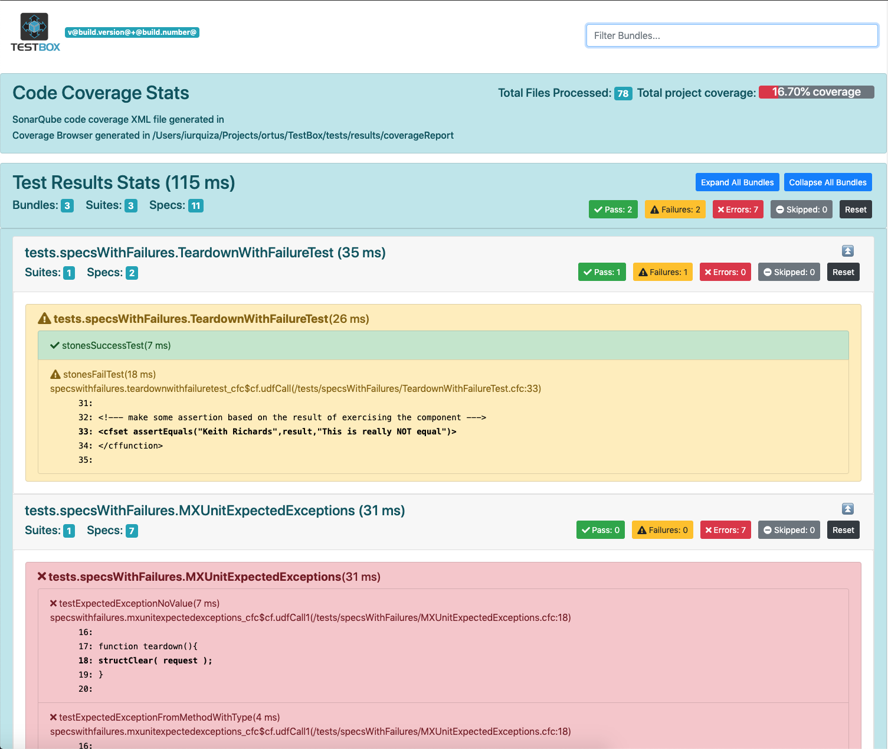

# What's New With 3.0.0


TestBox 3.0.0 is a major release.  It has compatibility changes that you should be aware and lots of good feaures!  

### Compatibility

The major compatibility issues are the engine support removals:

* Lucee 4.5 Support Dropped
* Adobe ColdFusion 10 Dropped

### Updating

It is easy to update, just type `update testbox` and you are done!

## Major Features

The most notable features of this release can be found below.

### Code Coverage

This has been fully documented and you can find much more information in the [code coverage](../../code-coverage/running-code-coverage.md) section.


### Static Test Visualizer



The **static test visualizer** is basically the simple reporter but works in offline mode.  This means that it will read a static TestBox results **json** file and create the report for it in the browser.  This is incredibly useful for CI integrations and representing any TestBox results json file visually.

#### Location

You will find the analyzer under `/test-visualizer` in the root of the TestBox installation.

```text
/test-analyzer
  + index.html (visualizer)
  + test-results.json (sample test results)
```

#### Running It

To run it all you need to do is put alongside of it a `test-results.json` file and then run the `index.html` and voila! Test Results Visualized!

## Release Notes

### Bugs

* \[[TESTBOX-234](https://ortussolutions.atlassian.net/browse/TESTBOX-234)\] - bddrunner.cfm: now compiles properly on ACF
* \[[TESTBOX-248](https://ortussolutions.atlassian.net/browse/TESTBOX-248)\] - Skip methods for given/when/then fail without \`this\` reference

### New Features

* \[[TESTBOX-236](https://ortussolutions.atlassian.net/browse/TESTBOX-236)\] - Add CodeCoverage Reporter to TestBox
* \[[TESTBOX-239](https://ortussolutions.atlassian.net/browse/TESTBOX-239)\] - Update the UI for the code coverage reporting and code visualizer
* \[[TESTBOX-243](https://ortussolutions.atlassian.net/browse/TESTBOX-243)\] - Complete UI updates for test reporters
* \[[TESTBOX-245](https://ortussolutions.atlassian.net/browse/TESTBOX-245)\] - Static Test Visualizer

### Improvements

* \[[TESTBOX-237](https://ortussolutions.atlassian.net/browse/TESTBOX-237)\] - Update usage of htmleditformat to encodeForHTML
* \[[TESTBOX-242](https://ortussolutions.atlassian.net/browse/TESTBOX-242)\] - Removal of old cfml engines support acf10 and lucee 4.5
* \[[TESTBOX-244](https://ortussolutions.atlassian.net/browse/TESTBOX-244)\] - streamify the code coverage collection
* \[[TESTBOX-249](https://ortussolutions.atlassian.net/browse/TESTBOX-249)\] - Add original method name to mocking function so it can help in debugging

