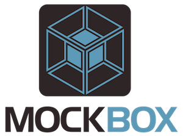

# MockBox



## Introduction

MockBox is a companion package to TestBox that will give you advanced mocking/stubbing capabilities; hence a Mocking Framework. You can use it from within TestBox or as a standalone package in any other testing framework or CFML application as a data provider.

## Download

Download from our [downloads page](http://www.ortussolutions.com/products/testbox) or clone via github. Also read our [installation](installing-mockbox.md) section.

```javascript
git clone git@github.com:Ortus-Solutions/TestBox.git
```

## Useful Resources

* [Approaches to Mocking](http://www.onjava.com/pub/a/onjava/2004/02/11/mocks.html)
* [Wikipedia Mock Objects](http://en.wikipedia.org/wiki/Mock_object)
* [Using mock objects for complex unit tests IBM developerWorks](http://www-128.ibm.com/developerworks/rational/library/oct06/pollice/index.html)
* [Unit testing with mock objects IBM developerWorks](http://www.ibm.com/developerworks/library/j-mocktest.html)
* [Emergent Design by Scott Bain](http://www.netobjectives.com/emergent-design-evolutionary-nature-professional-software-development)
* [Mocks Aren't Stubs by Martin Fowler](http://martinfowler.com/articles/mocksArentStubs.html)

