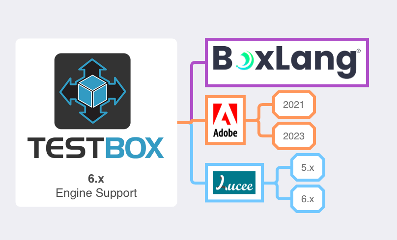

# What's New With 6.0.0

TestBox 6.x series is a major bump in our library.  Here are the major areas of improvement and the full release notes.

## BoxLang Has Arrived!

<figure><figcaption><p>www.boxlang.io</p></figcaption></figure>

[BoxLang](https://boxlang.io/) is the newest JVM language that can support running not only BoxLang language files but CFML files with our `bx-compat-cfml` module.  In TestBox 6 we now **not only** support and certify that it runs in CFML compatibility mode, but you can now create all your tests, specs and harnesses in BoxLang.  You can find the base test harness for BoxLang here: [https://github.com/Ortus-Solutions/TestBox/tree/development/bx/tests](https://github.com/Ortus-Solutions/TestBox/tree/development/bx/tests)

Here is a sample Spec written in BoxLang

```groovy
class extends="testbox.system.BaseSpec"{

    function run(){
	describe( "My First Test", ()=>{
		test( "it can add", ()=>{
			expect( sum( 1, 2 ) ).toBe( 3 )
		} )
	} )
    }

    private function sum( a, b ){
        return a + b
    }

}
```

### TestBox CLI

We have also updated the `testbox-cli` to now support BoxLang native generation. It will detect if you are in a BoxLang server or if you have the new `language` entry in your `box.json`

```json
{
    "name":"MyBoxLang Project",
    "version":"1.0.0",
    "language" : "boxlang" // or CFML or JAVA
}
```

Also all generation commands have a new `boxlang` argument, which is a boolean argument you can use to explicitly generate Boxlang code.

```bash
testbox create bdd MyTest --boxlang
testbox generate harness --boxlang
```


The CLI will detect if it's a BoxLang project if:

* If there is a CommandBox BoxLang server detected in the root of the project
* If the `runner` defined in your `box.json` is called `boxlang`&#x20;
* If the `language=boxlang` in your `box.json` is detected


### BoxLang CLI Runner

<figure><figcaption></figcaption></figure>

We have also created a new runner for BoxLang exclusively.  This runner allows you to run your specs, and bundles from the CLI with **no web server** required.  You can find the entire docs for the runner in our [BoxLang CLI Runner](whats-new-with-6.0.0.md#boxlang-cli-runner) page.  The runner must be run from the root of your BoxLang project:

#### Mac/Linux

```bash
./testbox/bin/run
./testbox/bin/run my.bundle
./testbox/bin/run --directory=tests.specs
./testbox/bin/run --bundles=my.bundle
```

#### Windows Examples:

```bash
./testbox/bin/run.bat
./testbox/bin/run.bat my.bundle
./testbox/bin/run.bat --directory=tests.specs
./testbox/bin/run.bat --bundles=my.bundle
```


Remember that BoxLang not only allows you to build web server applications, but also CLI applications, serverless (AWS Lambdas, Azure Functions), Android and more. &#x20;


#### Headless Web Server Testing

We have also created a new module called `bx-web-support` which will allow you to do headless web server testing right from the CLI.

```bash
// CommandBox
install bx-web-support

// BoxLang OS Binary
install-bx-module bx-web-support
```

This will add web support to the CLI (BIFS, components, etc.) and a mock HTTP server so you can do full life-cycle testing from the CLI like if running your app in a web server.  This runner does not require a web server to function, thus if you are building a web app, you will need this module if you still want to continue to execute your tests in the CLI Runtime.


If you are building exclusively a web application, we suggest you use the [CommandBox runner](../../getting-started/running-tests/commandbox-runner.md) which will call your runner via HTTP from the CLI.  You can also just use the [Web Runner](../../getting-started/running-tests/test-runner.md).


## Engine Support

Adobe 2018 has been dropped and BoxLang is now fully supported and certified with special features JUST for BoxLang.

<figure><figcaption></figcaption></figure>

## New Environment Helpers

All the test bundles will now inherit several new methods to assist in environment and OS detection:

| Method        | Purpose                                          |
| ------------- | ------------------------------------------------ |
| `isAdobe()`   | Are you running the test in an Adobe CFML Engine |
| `isLucee()`   | Are you running the test in a Lucee CFML Engine  |
| `isBoxLang()` | Are you running the test in a BoxLang Engine     |
| `isWindows()` | Are you in a windows OS                          |
| `isLinux()`   | Are you in a Linux OS                            |
| `isMac()`     | Are you in a Mac OS                              |


## New Spec Alias: test()

We have added a new method for your BDD tests called `test()` so you can create even further human-readable tests apart from `it(), then()`

```groovy
describe("User Authentication", () => {

    test("should successfully login with valid credentials", () => {
        var user = authenticate("validUser", "validPassword");
        expect( user.isAuthenticated() ).toBe(true);
    });

    test("should fail login with invalid credentials", () => {
        var user = authenticate("invalidUser", "invalidPassword");
        expect( user.isAuthenticated() ).toBe(false);
    });

});
```

## Display Names

If you are building your tests in xUnit mode, then you are getting more features especially for your reports.  Instead of just seeing the name of the function, you can now annotate it with a `displayName` annotation and give it a human readable title.



```cfscript
// Before
function testAddition(){
    assert( calc.add(2,3) == 5 )
}

function testMultiply(){
    assert( calc.multiply(2,3) == 6 )
}

// After

@DisplayName "My calculator can add"
function testAddition(){
    assert( calc.add(2,3) == 5 )
}

@DisplayName "My calculator can multiply"
function testMultiply(){
    assert( calc.multiply(2,3) == 6 )
}
```



```cfscript
// Before
function testAddition(){
    assert( calc.add(2,3) == 5 )
}

function testMultiply(){
    assert( calc.multiply(2,3) == 6 )
}

// After

function testAddition() DisplayName="My calculator can add"{
    assert( calc.add(2,3) == 5 )
}

function testMultiply() DisplayName="My calculator can multiply"{
    assert( calc.multiply(2,3) == 6 )
}
```



## BoxLang Dynamic Assertions

If you are writing your specs in BoxLang you will start to get further advantages than in CFML.  Here is the first one, dynamic assertion methods.  Before, in order to use the assertions library you had to use the `$assert` variable and call the assertion methods on it:

```cfscript
$assert.isTrue()
$assert.isFalse()
$assert.isEqual()
$assert.isNotEqual()
$assert.null()
```

Now, you can use our dynamic delegator and just simply your assertions:

```cfscript
assertIsTrue()
assertIsFalse()
assertIsEqual()
assertIsNotEqual()
assertNull()
```

All these dynamic methods will proxy to the [assertions library.](../../getting-started/testbox-xunit-primer/assertions.md)


## Release Notes

### New Features

[TESTBOX-391](https://ortussolutions.atlassian.net/browse/TESTBOX-391) MockBox converted to script

[TESTBOX-392](https://ortussolutions.atlassian.net/browse/TESTBOX-392) BoxLang classes support

[TESTBOX-393](https://ortussolutions.atlassian.net/browse/TESTBOX-393) New environment helpers to do skip detections or anything you see fit: isAdobe, isLucee, isBoxLang, isWindows, isMac, isLinux

[TESTBOX-394](https://ortussolutions.atlassian.net/browse/TESTBOX-394) new \`test(), xtest(), ftest()\` alias for more natuarl testing

[TESTBOX-397](https://ortussolutions.atlassian.net/browse/TESTBOX-397) debug() get's two new arguments: label and showUDFs

[TESTBOX-398](https://ortussolutions.atlassian.net/browse/TESTBOX-398) DisplayName on a bundle now shows up in the reports

[TESTBOX-399](https://ortussolutions.atlassian.net/browse/TESTBOX-399) xUnit new annotation for @DisplayName so it can show instead of the function name

[TESTBOX-401](https://ortussolutions.atlassian.net/browse/TESTBOX-401) BoxLang CLI mode and Runner

[TESTBOX-402](https://ortussolutions.atlassian.net/browse/TESTBOX-402) New matcher: toHaveKeyWithCase()

[TESTBOX-403](https://ortussolutions.atlassian.net/browse/TESTBOX-403) Assertions: key() and notKey() now have a CaseSensitive boolean argument

### Improvements

[TESTBOX-289](https://ortussolutions.atlassian.net/browse/TESTBOX-289) showUDFs = false option with debug()

[TESTBOX-331](https://ortussolutions.atlassian.net/browse/TESTBOX-331) TextReporter doesn't correctly support testBundles URL param

[TESTBOX-395](https://ortussolutions.atlassian.net/browse/TESTBOX-395) adding missing focused argument to spec methods

[TESTBOX-396](https://ortussolutions.atlassian.net/browse/TESTBOX-396) Generating a repeatable id for specs to track them better in future UIs

### Bugs

[TESTBOX-123](https://ortussolutions.atlassian.net/browse/TESTBOX-123) If test spec descriptor contains a comma, it can not be drilled down to run that one spec directly

[TESTBOX-338](https://ortussolutions.atlassian.net/browse/TESTBOX-338) describe handler in non-called test classes being executed

### Tasks

[TESTBOX-400](https://ortussolutions.atlassian.net/browse/TESTBOX-400) Drop Adobe 2018 support


