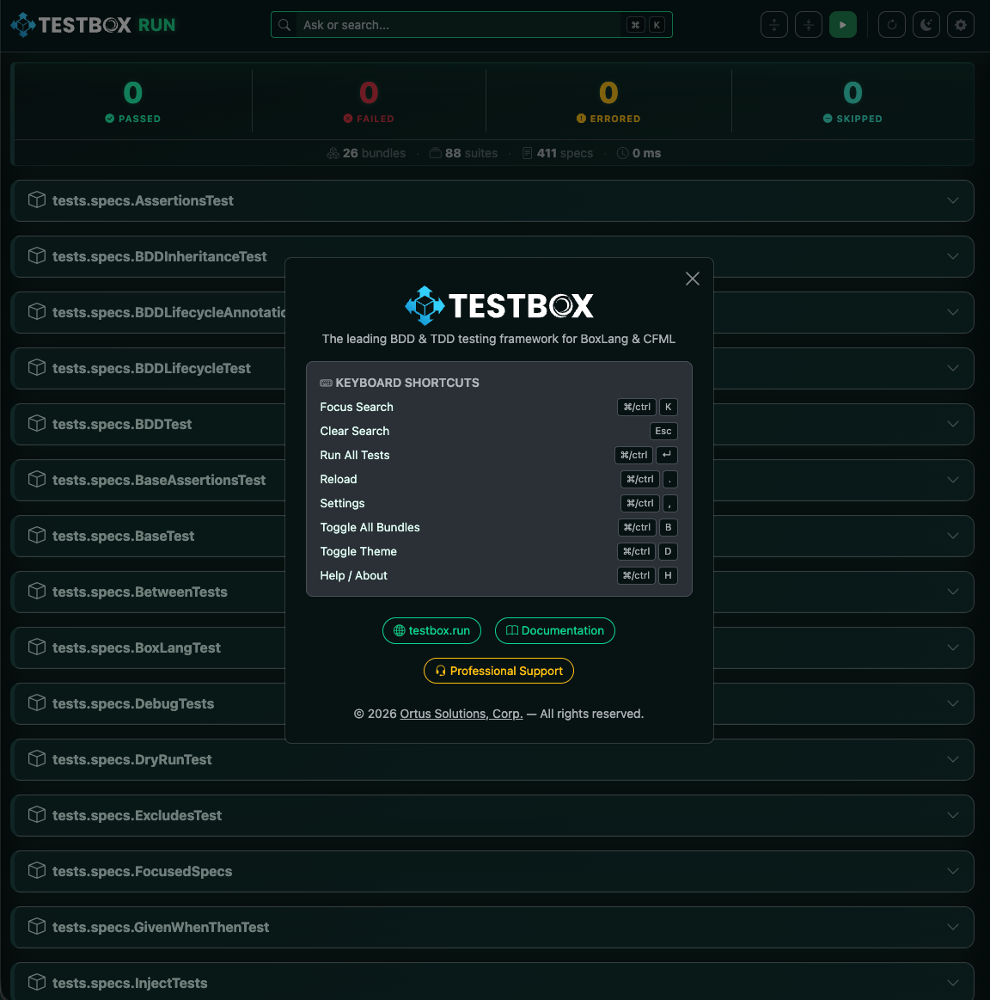
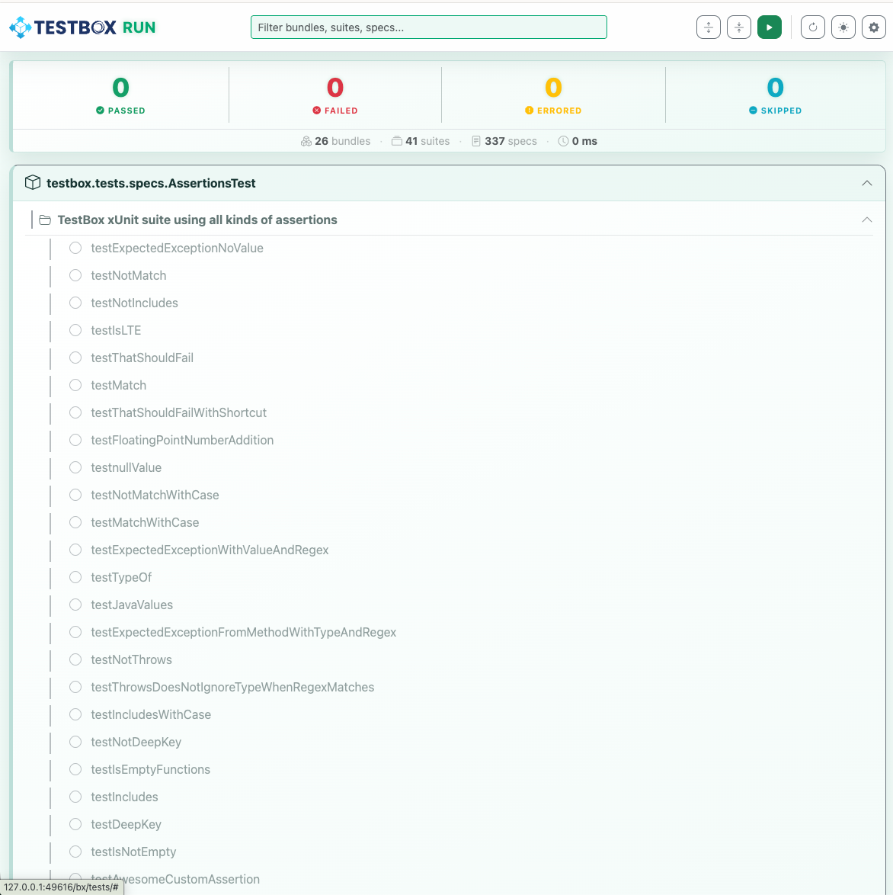
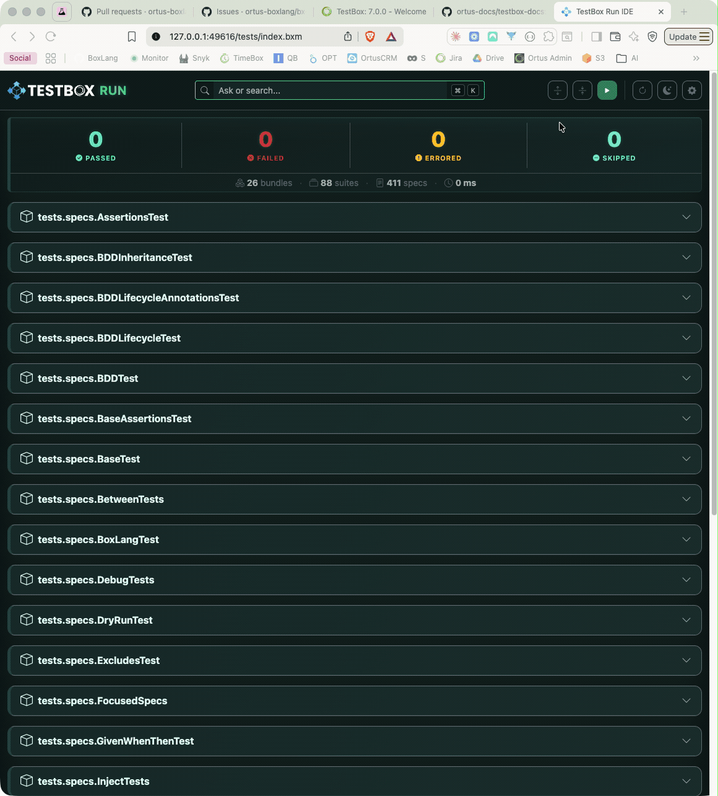
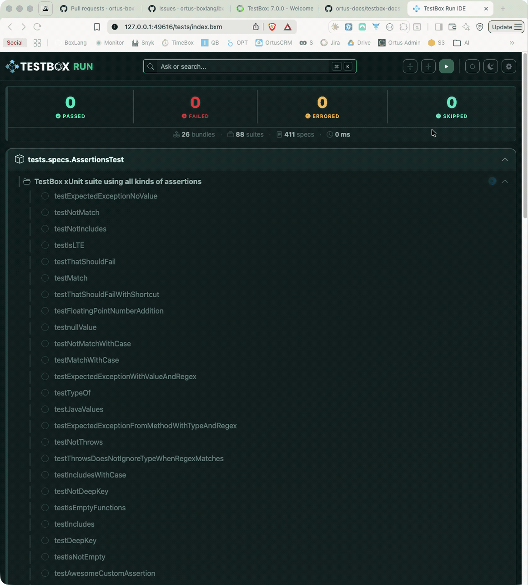
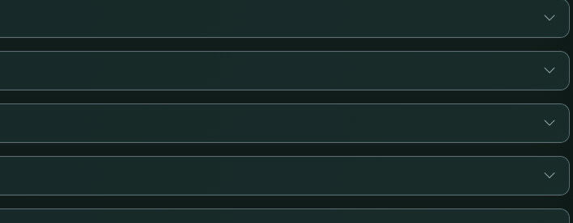
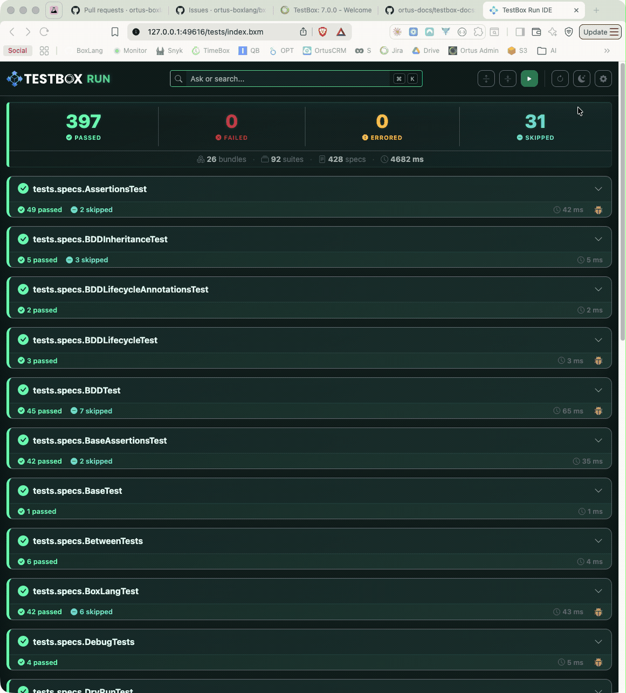
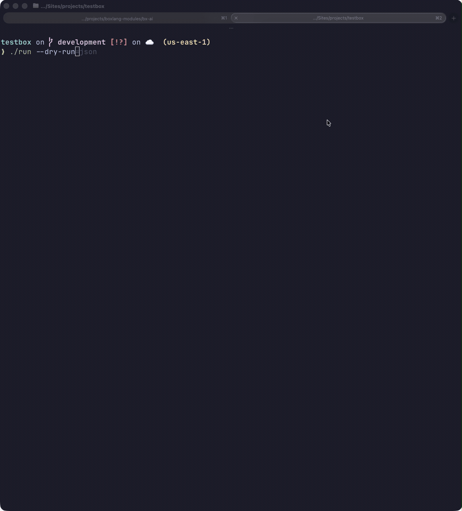
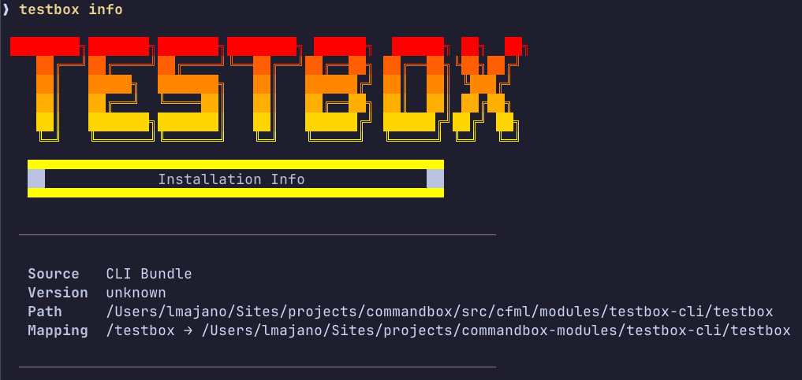

# What's New With 7.0.0

TestBox 7.x series continues our mission to be the best testing framework for BoxLang and CFML.  This release is focused heavily on **BoxLang CLI runner enhancements**, real-time **streaming test execution via SSE**, a powerful **dry run** capability, the brand-new **TestBox RUN** web IDE, and significant quality-of-life improvements for developers working in both BoxLang and CFML environments.

.png>)

Finally, we have certified TestBox 7 for Lucee 7 and dropped support for Adobe 2021 to focus on modern engines and features.

## TestBox RUN — The BoxLang Test IDE


**TestBox RUN** is a brand-new, BoxLang-native test runner and IDE shipped as part of TestBox 7.  It is a fully-featured browser-based interface for discovering, running, and streaming your test results in real time — all powered by BoxLang and the new `StreamingRunner` SSE engine.

### What Is It?

TestBox RUN is a self-hosted single-page web app (`bx/tests/index.bxm`) that you drop into your BoxLang project and open in your browser.  It communicates with your existing `runner.bxm` endpoint and streams spec results as they complete via **Server-Sent Events**. No build toolchain, no external service — just BoxLang.

### Feature Highlights

#### Real-Time Streaming Test Tree


Results appear in the UI as each spec finishes.  The test tree updates live — passing specs turn green, failures turn red, and errors surface immediately with their full message — long before the suite finishes.

#### Beautiful, Responsive UI




* **Dark / Light theme toggle** with preference persistence in `localStorage`
* **Keyboard-first UX** with a full set of shortcuts:

| Shortcut | Action |
| --- | --- |
| `⌘/Ctrl + K` | Focus the search bar |
| `Esc` | Clear search |
| `⌘/Ctrl + Enter` | Run all tests |
| `⌘/Ctrl + .` | Reload / rediscover tests |
| `⌘/Ctrl + ,` | Open Settings |
| `⌘/Ctrl + B` | Toggle expand/collapse all bundles |
| `⌘/Ctrl + D` | Toggle dark/light mode |
| `⌘/Ctrl + H` | Open the About / Help dialog |

#### Live Search & Filtering



A **search bar** at the top lets you instantly filter the test tree by bundle, suite, or spec name.  Combined with the **status filter chips** (Passed / Failed / Errored / Skipped), you can zero in on exactly the tests you care about.

#### Per-Bundle Run & Summary Strip



Each bundle card has its own **▶ Run** button so you can re-run a single bundle without re-running the entire suite.  A compact **results strip** beneath each bundle header shows pass/fail/error/skipped counts and total duration at a glance.

#### Debug Buffer Panel


Any output captured in the TestBox debug buffer during a run is surfaced in a collapsible per-bundle **Debug Panel**, accessible via a bug icon on the bundle strip.  Each entry is rendered with its label and a formatted data view.

#### Floating Progress Widget



A floating progress widget appears during active runs, showing:

* Current bundle running
* Specs completed vs. total
* Animated progress bar with percentage

#### Configurable Settings



Click the gear icon (or `⌘/Ctrl + ,`) to open the **Settings modal**, where you can configure:

* Runner URL (relative path or absolute HTTP/S)
* Directory and bundles pattern
* Recurse toggle
* Labels and excludes

All settings are saved in `localStorage` and applied on the next visit.  Every setting can also be overridden via URL query parameters for quick CI integration:

```
/tests/?directory=tests.specs.integration&labels=slow&runnerUrl=/tests/runner.bxm
```

### Getting Started with TestBox RUN

TestBox RUN is included automatically with every TestBox 7 installation under `bx/tests/`.  Point your web server at `bx/tests/index.bxm` and open it in your browser.

Every ColdBox application generated with our `ColdBox CLI` will also include TestBox RUN out of the box.

You can also generate a new test harness with TestBox RUN support using the `testbox generate` command:

```bash
testbox generate harness --help
```


TestBox RUN requires a running web server and a `runner.bxm` (or `runner.bx`) endpoint that supports the SSE streaming protocol.  If you are building a pure CLI application, use the [BoxLang CLI runner](../../getting-started/running-tests/boxlang-runner.md) with `--stream` instead.


### Coming Soon: TestBox RUN Desktop App


**Exciting news for BoxLang Desktop Runtime fans!**

We are actively working on a **native desktop application** version of TestBox RUN, built entirely on the **BoxLang Desktop Runtime**.  The desktop app will connect to any web-accessible runner URL — local or remote — and provide the same beautiful real-time streaming UI without a browser.  Stay tuned at [testbox.run](https://www.testbox.run) for announcements, early access, and previews.


## Engine Support

Adobe 2021 has been dropped and Lucee 7 is now fully supported and certified.

| Engine          | Supported |
| --------------- | --------- |
| BoxLang 1.x+    | ✅ PREFERRED |
| Lucee 5.x       | ✅ DEPRECATED |
| Lucee 6.x       | ✅         |
| Lucee 7.x       | ✅ NEW     |
| Adobe 2023      | ✅ DEPRECATED |
| Adobe 2025      | ✅         |
| Adobe 2021      | ❌ Dropped |


Adobe 2021 is no longer supported as of TestBox 7.  Please upgrade to Adobe 2023+ or migrate to [BoxLang](https://boxlang.io/).


## TestBox RUN

## Dry Run & Spec Discovery

Two long-requested features have finally landed: the ability to **discover** which specs will run without executing them, and a full **dry run** mode.  These are invaluable for large test suites where you need to audit coverage or validate filtering before committing to a full run.

Call the `dryRun()` method on your TestBox instance to execute the full discovery and filtering pipeline and get a complete report of what **would have** run — without actually invoking any spec closures.

```javascript
var tb      = new testbox.system.TestBox( bundles = "tests.specs" );
var results = tb.dryRun();
```

The BoxLang CLI runner also gains a `--dry-run` flag that performs the same discovery and filtering process, outputting a structured report of all suites and specs that would have been executed:



```bash
./testbox/run --dry-run
```

The output lists every suite and spec that would be executed, along with their labels and any skip reasons — perfect for CI pipeline auditing and test inventory reporting.

### Dry Run JSON Output

Pass `--dry-run=json` to receive the full discovery payload as raw JSON instead of the formatted text output.  This is ideal for programmatic consumption — CI tools, custom reporters, or any external script that needs to process the test inventory:

```bash
./testbox/run --dry-run=json
./testbox/run --dry-run=json --bundles=tests.specs.MySpec | jq .
```


Dry run mode respects all the same filtering options as a normal run: `--labels`, `--bundles`, `--directory`, `--testSuites`, `--testSpecs`, etc.


## Streaming Runner & Real-Time Output (TESTBOX-441, TESTBOX-442)

TestBox 7 introduces a brand-new **StreamingRunner** that pushes test results to the client as they complete via **Server-Sent Events (SSE)**.  This means you no longer have to wait for the entire suite to finish before seeing results — each spec result is streamed in real time.  This of course, requires an SSE-capable client, but it opens up powerful new workflows for CI pipelines and large test suites where immediate feedback is crucial.

### StreamingRunner

The new `StreamingRunner.cfc` is available under `testbox.system.runners.StreamingRunner` and can be used programmatically or wired into any SSE-capable endpoint.

```javascript
component {
    function streamTests( event, rc, prc ) {
        event.setHTTPHeader( name="Content-Type", value="text/event-stream" );
        event.setHTTPHeader( name="Cache-Control", value="no-cache" );

        new testbox.system.runners.StreamingRunner(
            bundles  = "tests.specs",
            options  = {},
            reporter = "text"
        ).run();
    }
}
```

### BoxLang CLI `--stream` Flag

The BoxLang CLI runner gains a `--stream` flag that activates real-time output of test results as they execute rather than buffering until completion:

```bash
./testbox/run --stream
./testbox/run --directory=tests.specs --stream
```


Streaming output is especially useful in CI environments where you want live progress rather than waiting for the full suite to complete before seeing any output.


## BoxLang Runner Enhancements

The BoxLang CLI runner has received a significant set of new options that give you fine-grained control over output, failure reporting, and performance analysis.

### `--show-failed-only` (TESTBOX-444)

Focus your terminal output exclusively on failures and errors, suppressing all passing and skipped specs:

```bash
./testbox/run --show-failed-only
```

### `--stacktrace` Control (TESTBOX-445)

Choose how much stack trace detail is shown for failures and exceptions.  The default is `short` to keep output readable:

```bash
./testbox/run --stacktrace=short   # default: condensed first frame
./testbox/run --stacktrace=full    # complete Java/BoxLang stack trace
```

### Output & Performance Options (TESTBOX-446)

A full suite of output-control and performance-analysis flags are now available:

```bash
# Show or hide passing specs (default: true)
./testbox/run --show-passed=false

# Show or hide skipped specs (default: true)
./testbox/run --show-skipped=false

# Abort the run after N failures
./testbox/run --max-failures=10

# Flag any spec that takes longer than N milliseconds as slow
./testbox/run --slow-threshold-ms=500

# Print a summary of the N slowest specs at the end of the run
./testbox/run --top-slowest=5
```

Combining these gives you a clean, focused workflow:

```bash
./testbox/run --show-failed-only --stacktrace=short --max-failures=5 --top-slowest=3
```

### Application Mappings Auto-Load (TESTBOX-440)

The BoxLang runner now **automatically attempts to load `Application.bx` mappings** from your project root before executing tests.  This means any custom path mappings, datasources, or settings defined in your `Application.bx` are available to your specs without any extra configuration.


This brings the BoxLang CLI runner experience much closer to running tests in a full web server environment, reducing the friction of maintaining separate CLI-specific configuration.


## New `ConsoleUtil` Toolkit (TESTBOX-443)

A new `ConsoleUtil` class has been added to `testbox.system.util.ConsoleUtil` to provide a rich set of helpers for building beautiful CLI tooling on top of TestBox.  It includes support for:

* **ANSI color and style** output helpers
* **Bordered and padded boxes** for drawing section headers
* **Progress indicators** and spinner helpers
* **Table rendering** for structured output
* **Symbols and icons** normalized across platforms

```javascript
var console = new testbox.system.util.ConsoleUtil();

console.printLine( console.green( "All tests passed!" ) );
console.printBox( "Suite: My Application Tests", style="double" );
console.printKeyValue( "Total Specs", 142 );
console.printKeyValue( "Failures",    0,  color="green" );
```

## `ConsoleReporter` — Hide Skipped Tests (TESTBOX-433)

The `ConsoleReporter` now accepts a `hideSkipped` option (default `false`) so you can suppress skipped spec output for cleaner terminal readability when you have many pending specs:

```javascript
var testbox = new testbox.system.TestBox(
    bundles  = "tests.specs",
    reporter = {
        type        : "testbox.system.reports.ConsoleReporter",
        options     : { hideSkipped : true }
    }
);
```

From the BoxLang CLI runner, use `--show-skipped=false` (see above).

## Suite Filtering Improvements (TESTBOX-435)

TestBox now performs **direct suite name matching** when the `testSuites` filter is active.  Previously, nested suites could be skipped even when they exactly matched the filter value.  Now, if a suite's name is a direct match for the filter, it will always be included regardless of nesting depth.

This makes granular suite targeting far more reliable from all runners:

```bash
# Via CLI runner
./testbox/run --testSuites="My Integration Suite"

# Via TestBox directly
new testbox.system.TestBox(
    bundles    = "tests.specs",
    testSuites = "My Integration Suite"
).run();
```

## TestBox CLI Updates



The `testbox-cli` CommandBox module has received a major update in version **1.8.0** to align with TestBox 7.

### New Commands

#### `testbox info`

A new `testbox info` command displays detailed information about the current TestBox installation, including the installed version, installation path, and key configuration detected in your project:

```bash
testbox info
```

#### `testbox reinstall`

A new `testbox reinstall` command forces a clean reinstallation of the TestBox CLI package itself — useful when you suspect your current installation is corrupted or outdated:

```bash
testbox reinstall
```


This command reinstalls the `testbox-cli` CommandBox module only, not the TestBox library itself.  To reinstall the TestBox library, use `box install testbox --force`.


### Streaming Results via `testbox run --streaming`

The `testbox run` command now supports a `--streaming` flag that taps into the new `StreamingRunner` to deliver real-time test results to your terminal as each spec completes rather than buffering until the entire suite finishes:

```bash
testbox run --streaming
```

Pair it with `--verbose` to include all passing specs in the live output — by default only failures and skipped specs are persisted:

```bash
testbox run --streaming --verbose
```


Streaming output is ideal for CI environments where you want immediate feedback on test progress rather than waiting for the full suite to complete before seeing any results.  It works best with BoxLang, but can be used with CFML engines that support SSE as well.


### TestBox RUN Integration

The CLI now ships with support for the new **TestBox RUN** runner for BoxLang, enabling native SSE-based streaming runs directly from the CommandBox CLI without needing a separate web server.

### Template Updates

Both CFML and BoxLang generation templates have been refreshed to reflect the latest TestBox 7 conventions and best practices.

### Bug Fixes

* `getTestBoxDescriptor()` argument was previously ignored and is now correctly applied.
* The `testbox` package is now used as the single source of truth for version and descriptor resolution rather than duplicating logic across the CLI module, preventing potential drift.

### Improved Help Messages

All commands have received updated help text with clearer descriptions, usage examples, and argument documentation.

## Release Notes

### Bugs

| # | Title |
| --- | --- |
| [TESTBOX-432](https://ortussolutions.atlassian.net/browse/TESTBOX-432) | `toBeWithCase` needs the `caseSensitive` flag set |
| [TESTBOX-436](https://ortussolutions.atlassian.net/browse/TESTBOX-436) | Trim is killing leading ANSI escapes by removing `chr(27)` in the console reporter |
| [TESTBOX-437](https://ortussolutions.atlassian.net/browse/TESTBOX-437) | Update location detection of TestBox library on Windows for `BoxLangRunner.bx` |
| [TESTBOX-438](https://ortussolutions.atlassian.net/browse/TESTBOX-438) | CLI args not being passed to runner on Windows using BoxLang |
| [TESTBOX-439](https://ortussolutions.atlassian.net/browse/TESTBOX-439) | Fix TestBox scanning from the root if directory was not passed but bundles were using the BoxLang Runner |

### Improvements

| # | Title |
| --- | --- |
| [TESTBOX-430](https://ortussolutions.atlassian.net/browse/TESTBOX-430) | BoxLang PRIME updates for detecting CGI scopes when doing CLI testing instead of web |
| [TESTBOX-434](https://ortussolutions.atlassian.net/browse/TESTBOX-434) | Improve static block usage on BoxLang runner |
| [TESTBOX-435](https://ortussolutions.atlassian.net/browse/TESTBOX-435) | Determine if a suite is a DIRECT match for the `testSuites` filter; if so, run it — allows reliable suite filtering via runners |
| [TESTBOX-440](https://ortussolutions.atlassian.net/browse/TESTBOX-440) | Attempt to load `Application` mappings using the BoxLangRunner |

### New Features

| # | Title |
| --- | --- |
| [TESTBOX-213](https://ortussolutions.atlassian.net/browse/TESTBOX-213) | Allow retrieving specs that will be run |
| [TESTBOX-324](https://ortussolutions.atlassian.net/browse/TESTBOX-324) | Enable a "Dry Run" so you can get a list of tests without actually running them |
| [TESTBOX-431](https://ortussolutions.atlassian.net/browse/TESTBOX-431) | Lucee 7 certification |
| [TESTBOX-433](https://ortussolutions.atlassian.net/browse/TESTBOX-433) | `ConsoleReporter` option `hideSkipped` to omit skipped tests from output |
| [TESTBOX-441](https://ortussolutions.atlassian.net/browse/TESTBOX-441) | New `StreamingRunner` to provide execution streaming of tests via SSE |
| [TESTBOX-442](https://ortussolutions.atlassian.net/browse/TESTBOX-442) | New `--stream` option for the BoxLang runner to stream results and tests in real-time |
| [TESTBOX-443](https://ortussolutions.atlassian.net/browse/TESTBOX-443) | New `ConsoleUtil` for building beautiful CLI tooling |
| [TESTBOX-444](https://ortussolutions.atlassian.net/browse/TESTBOX-444) | New `--show-failed-only` option for the BoxLang Runner |
| [TESTBOX-445](https://ortussolutions.atlassian.net/browse/TESTBOX-445) | New `--stacktrace=short\|full` option for the BoxLang runner |
| [TESTBOX-446](https://ortussolutions.atlassian.net/browse/TESTBOX-446) | New BoxLang runner options: `--show-passed`, `--show-skipped`, `--max-failures`, `--slow-threshold-ms`, `--top-slowest` |

### Tasks

| # | Title |
| --- | --- |
| [TESTBOX-447](https://ortussolutions.atlassian.net/browse/TESTBOX-447) | Drop Adobe 2021 support |