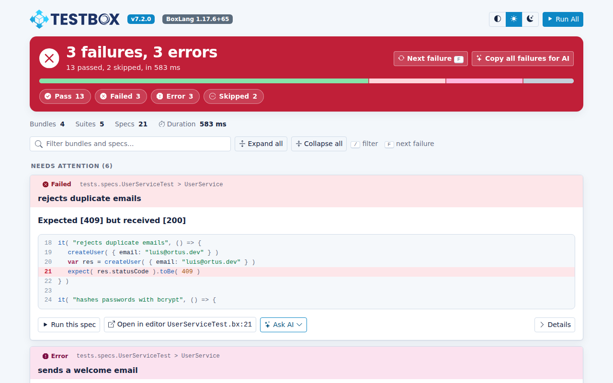
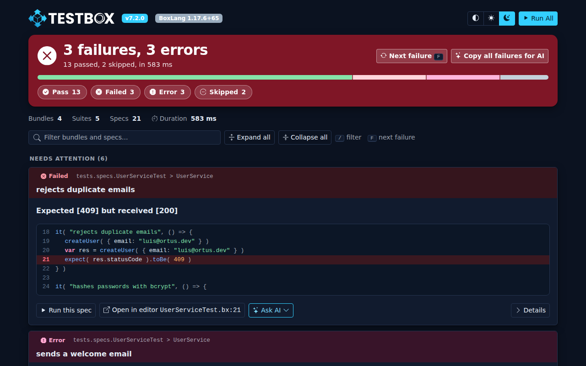
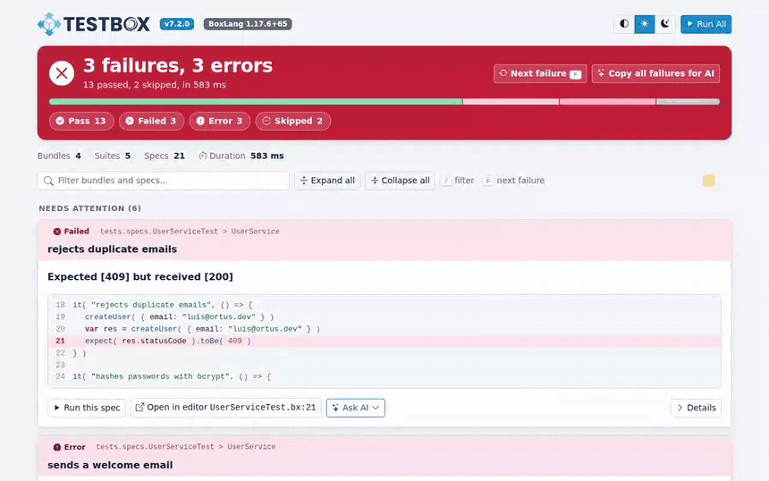
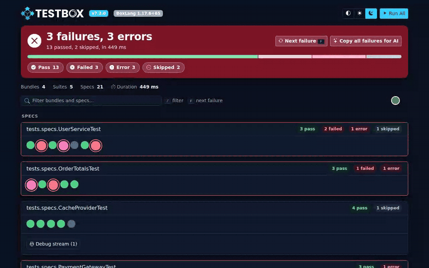
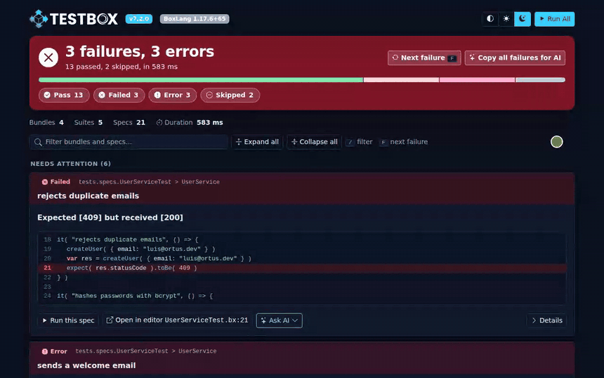
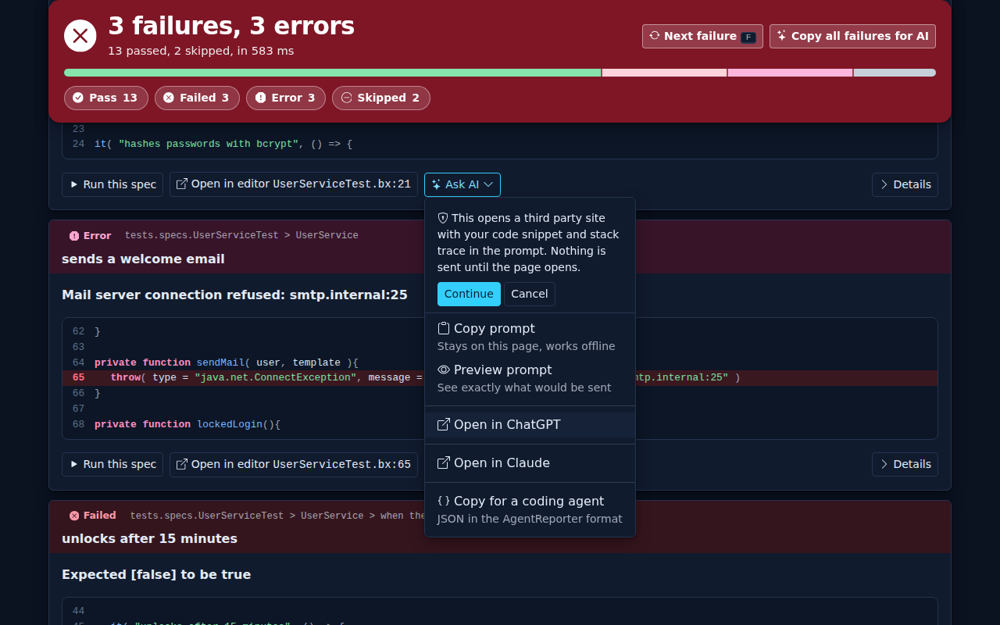

# What's New With 7.2.0

TestBox 7.2.0 brings **browser testing** to TestBox. Built on the [bx-playwright](https://bxplaywright.boxlang.io) module, BoxLang specs can now drive a real browser, assert on pages with web-first matchers, and keep the screenshots, traces and videos of failures. Around it, TestBox gains features that every test suite benefits from, on every engine: spec attachments, retries, a **Run Failed** option, and BoxLang runner options to start your web server. The HTML reporters get a complete new look and an **Ask AI** assistant for every failure, and the new **Agent reporter** lets AI agents and automation read a test run with a minimal token cost.


This release is not out yet. The release date will be added here when it ships.


## Highlights

* **[Browser testing](#browser-testing)** on BoxLang with bx-playwright, turned on by a `@browser`, `@browserProfile` or `@baseURL` class annotation.
* **[Browser matchers](#browser-matchers)** such as `toSee()`, `toHavePath()` and `toBeVisible()` that wait until they pass.
* **[Spec attachments](#spec-attachments-attach)** with `attach()`, shown in the HTML, JSON, text and JUnit reports.
* **[Spec retries](#spec-retries)** per spec, per bundle or for the whole run.
* **[Run only what failed](#run-only-what-failed)** with a **Run Failed** button, `--failed` and `TestResult.getFailedTargets()`.
* **[`--web-server`](#boxlang-runner-web-server)** runner options that start your application for the run.
* **[New HTML reporters](#a-new-look-for-the-html-reporters)** with light and dark themes, inline screenshots and **Ask AI** on every failure.
* **[Agent reporter](#agent-reporter)**, a token-efficient JSON reporter for AI agents and automation.

* * *

## Browser Testing


Browser specs and the browser matchers require BoxLang and the bx-playwright module. Write browser specs as BoxLang classes (`.bx`) and keep them out of Lucee and Adobe runs, where the browser annotations do nothing. On BoxLang without bx-playwright, `browse()` skips the running spec with an install hint: `bx-playwright is not installed: install-bx-module bx-playwright`.


Turn browser support on with a class annotation, `@browser`, `@browserProfile` or `@baseURL`, on any spec whose class, or a class it extends, carries it. No special base class is needed. Then call `browse()`: every declared closure argument gets a fresh page in its own isolated browser context, and the bundle shares one browser that the runner closes after the bundle, even when an `afterAll()` throws.

```java
@baseURL( "http://localhost:8080" )
@browserProfile( "ci" )
class extends="testbox.system.BaseSpec" {

    function run() {
        describe( "Login", () => {
            it( "signs in", () => {
                browse( ( page ) => {
                    page.visit( "/login" )
                        .fill( "Email", "luis@ortus.com" )
                        .fill( "Password", "secret" )
                        .click( "Sign in" )
                    expect( page ).toHavePath( "/dashboard" )
                    expect( page ).toSee( "Welcome" )
                } )
            } )
        } )
    }

}
```

* `@browser`, `@browserProfile` and `@baseURL` class annotations turn browser support on, and are inherited from parent classes: put `@browser` on your project base spec and its children can browse, and `@browser( false )` opts a child out. It works for BDD and xUnit bundles on any base class, such as `testbox.system.BaseSpec` or a ColdBox `BaseTestCase`.
* The runner mixes `browse()`, `browserAvailable()`, `ensureBrowserInstalled()`, `getBrowserSupport()` and `closeBrowser()` into the spec, adds `this.playwright()` and registers the browser matchers. Public methods your spec declares itself are kept; a private method with the same name is replaced.
* `testbox.system.BrowserSpec` is an optional base class that carries `@browser`.
* The browser of the bundle profile is installed on first use, unless the profile uses a branded channel such as `chrome` or `msedge` (it needs network access, and Linux needs the system libraries from `bxPlaywright install chromium --with-deps`). Use `@browserAutoInstall( false )` to require a pre-installed browser, or `ensureBrowserInstalled()` to install it yourself. TestBox needs a bx-playwright version that provides `playwrightEnsureBrowser()`, the first stable release or later.
* `browse( callback, options )` with one page per declared argument, for multi-user flows.
* `this.playwright()` for the bundle's bx-playwright manager, and `browserAvailable()` for skip constraints.
* The logic lives in `testbox.system.browser.BrowserSupport`, usable from any BoxLang code.

Read the [Browser Testing guide](../../browser-testing/README.md).

## Browser Matchers

Nine web-first matchers for bx-playwright pages and locators, each with its `not` form. They retry until they pass or the assertion timeout expires, and fail with Playwright's expected, received and call log message.

```java
expect( page ).toHaveTitle( "Dashboard" )
expect( page ).toHaveURL( page.regex( "/orders/\d+$" ) )
expect( page ).toHavePath( "/dashboard" )
expect( page ).toSee( "Welcome" )
expect( page.locator( "h1" ) ).toHaveText( "Your Orders" )
expect( page.locator( "@menu" ) ).toBeVisible()
expect( page.locator( ".spinner" ) ).toBeHidden()
expect( page.locator( ".cart li" ) ).toHaveCount( 2 )
expect( page.byLabel( "Email" ) ).toHaveValue( "luis@ortus.com" )
```

Browser bundles register them for you; any other BoxLang spec can use `addMatchers( new testbox.system.browser.BrowserMatchers() )`. See [Browser Matchers](../../browser-testing/browser-matchers.md).

## Spec Attachments: `attach()`

Every spec can attach files to its result, on every engine: `attach( path, type = "file", name = "" )`. A failed `browse()` attaches the screenshots, trace and videos bx-playwright kept.



```java
it( "renders the PDF", () => {
    var pdf = getTempDirectory() & "report.pdf"
    new models.Reports().monthly( pdf )
    attach( pdf, "file", "Monthly report" )
} )
```



```cfscript
it( "renders the PDF", function(){
    var pdf = getTempDirectory() & "report.pdf";
    new models.Reports().monthly( pdf );
    attach( pdf, "file", "Monthly report" );
} );
```



Attachments land in the new `attachments` array of the spec stats. The JSON report includes them, the HTML reports show screenshots inline as thumbnails that open full size and link the other files, the text, console and stream outputs list them under failed specs, and the JUnit and ANT JUnit reports add one `[[ATTACHMENT|path]]` line per file in `<system-out>`, the format the Jenkins JUnit Attachments plugin and GitLab understand. See [Attachments](../../browser-testing/attachments.md).

## Spec Retries

Rerun a failing or erroring spec, with its `beforeEach()` and `afterEach()` (or `setup()` and `teardown()`), up to N more times, on every engine:



```java
@retries( 1 )
class extends="testbox.system.BaseSpec" {

    function run() {
        describe( "Payment gateway", () => {
            it( title = "charges a card", body = () => {
                expect( gateway.charge( 100 ).status ).toBe( "succeeded" )
            }, retries = 3 )
        } )
    }

}
```



```cfscript
component extends="testbox.system.BaseSpec" retries="1" {

    function run(){
        describe( "Payment gateway", function(){
            it( title = "charges a card", body = function(){
                expect( gateway.charge( 100 ).status ).toBe( "succeeded" );
            }, retries = 3 );
        } );
    }

}
```



* A `retries` argument on `it()`, `fit()` and `xit()`, a `retries` bundle annotation, a `retries` method annotation for xUnit tests, and a global `retries` runner option (`--retries=N` on the BoxLang runner).
* The spec value wins over the bundle annotation, which wins over the global option. Skipped specs are never retried.
* The new `attempts` spec stat counts the runs, and reporters show `(passed after 2 attempts)`.

See [Retries](../../browser-testing/retries.md).

## Run Only What Failed

* **HTML reports:** the Simple, Min, Dot and Doc reports show a **Run Failed (N)** button next to **Run All** when something failed. The link is built from the report, so the web runners keep no state.
* **BoxLang runner:** every run writes `{reportpath}/.testbox-failed.json` with the bundles and spec ids that failed or errored, and `./testbox/run --failed` reruns only those.
* **From code:** `TestResult.getFailedTargets()` returns `{ bundles, specs, bundleErrors }` on every engine.

```bash
./testbox/run                # 3 specs fail, .testbox-failed.json lists them
./testbox/run --failed       # reruns only those 3
```

Bundles that failed outside of a spec (`beforeAll()`, `afterAll()`) go to `bundleErrors`: they are listed, not rerun. When the file is missing or lists nothing, `--failed` prints a message and runs nothing. See [Rerun What Failed](../../browser-testing/running-browser-tests.md#rerun-what-failed-failed).

## BoxLang Runner: `--web-server`

Start your application before the tests, wait until it answers, and stop it with its child processes afterwards:

```bash
./testbox/run --web-server="boxlang-miniserver --port 8080" --web-server-url=http://localhost:8080 --web-server-timeout=60
```

The runner exits with code 1 when the server does not answer in time. The URL becomes the default `baseURL` of browser bundles. See [Running Browser Tests](../../browser-testing/running-browser-tests.md).

* * *

## A New Look For The HTML Reporters

The `Simple`, `Min`, `Dot` and `Doc` reporters have been rebuilt and made reactive thanks to AlpineJS, with light and dark themes on the TestBox palette and the new TestBox logos. They keep every feature they had, and they are still fully inlined, so reports run airgapped. A page also went from about 1.4 MB to about 0.45 MB when fully loaded.



<figure><figcaption><p>Simple, light mode</p></figcaption></figure>

<figure><figcaption><p>Simple, dark mode</p></figcaption></figure>

### At A Glance

* **The verdict first.** A green or red banner with the totals, a proportion bar and status filters, so a failing run can not be missed. A bundle that could not run gets its own alert above it.
* **Light, dark and system themes**, applied before the page paints and remembered in your browser.
* **Keyboard navigation.** Press `F` to jump to the next failure and `/` to search.
* **Filters everywhere.** Filter the whole report or a single bundle by status, and search by name.
* **Highlighted code** for BoxLang and CFML, with the failing line marked.
* **Run links** on every bundle, suite and spec. They are plain links, so a refresh runs them again.
* **Run All and Run Failed.** When something failed, a **Run Failed (N)** button reruns only those specs. The link is built from the report, so the web runner keeps no state. See [Run Only What Failed](#run-only-what-failed).
* **Dot opens a drawer** with the details, the code and Ask AI, instead of an `alert()`. **Doc** has a bundle navigation.
* **Responsive**, so a CI artifact is readable on a phone.

<figure><figcaption><p>Press <code>F</code> to jump from failure to failure</p></figcaption></figure>

<figure><figcaption><p>Dot opens the details in a drawer</p></figcaption></figure>

### Screenshots In The Report

Image attachments, such as failure screenshots, show as thumbnails that open full size. They are embedded in the page, so they work over http and in saved reports. Images up to the new `inlineImageMaxKB` reporter option (default `2048`, `0` turns it off) are embedded, larger ones stay links. A trace attachment offers a **Copy show-trace command** button.

```java
new testbox.system.TestBox(
    bundles  = "tests.specs",
    reporter = { type : "simple", options : { inlineImageMaxKB : 512 } }
).run()
```

See [Screenshots in the HTML Reports](../../browser-testing/attachments.md#screenshots-in-the-html-reports).

### Ask AI

Every failure and error has an **Ask AI** menu. It builds a prompt with the spec, the message, the code around the failing line, the first stack frames and the command that runs only that spec again. You can copy it, preview it, open it in ChatGPT or Claude, or copy the failure as JSON for a coding agent. **Copy all failures for AI** builds one prompt for the whole run.

<figure><figcaption><p>Ask AI menu and prompt preview</p></figcaption></figure>

Ask AI is on by default. Nothing leaves the page until you click a provider, and the first time you do, the page tells you what will happen and waits for your confirmation. Use the `aiAssist`, `aiProviders`, `aiContextLines`, `aiStackFrames` and `aiPrompt` reporter options to configure it, or `?aiAssist=false` to switch it off for a run. See [Ask AI options](../../digging-deeper/reporters/html-reporters.md#options).

<figure><figcaption><p>The first-use notice</p></figcaption></figure>

### Reports From Code

The `urlParams` reporter option sets request params such as `editor` and `aiAssist` when you produce a report from code and there is no `url` scope, for example with the BoxLang CLI:

```java
reporter = { type : "simple", options : { urlParams : { editor : "idea", aiAssist : "false" } } }
```

### Upgrade Notes


**Changed in TestBox 7.2:** the `url.fullPage` switch was removed. An HTML reporter always returns a complete page. If you embedded a reporter in your own page, include it in an `<iframe>` or use the `JSON` reporter and render the data yourself.



The report templates now keep only markup. Their logic lives in `system/reports/ReportHelper.cfc` and `BaseHTMLReporter.cfc`. The reporters share one base class, `BaseHTMLReporter`. The inlined front-end libraries are rebuilt from `build/vendor` with `box run-script assets:update`.


Everything about the new reporters is documented in [HTML Reporters](../../digging-deeper/reporters/html-reporters.md).

* * *

## Agent Reporter

The new `Agent` reporter returns a single minified JSON line with the totals and only the specs that failed or errored. A passing run is a few dozen tokens, where the `JSON` reporter returns the full result set.




```bash
./testbox/run --reporter=agent
```



```java
var testbox = new testbox.system.TestBox(
    bundles  = "tests.specs",
    reporter = {
        type    : "testbox.system.reports.AgentReporter",
        options : { maxFailures : 10 }
    }
)
println( testbox.run() )
```





```cfscript
var testbox = new testbox.system.TestBox(
    bundles  = "tests.specs",
    reporter = {
        type    : "testbox.system.reports.AgentReporter",
        options : { maxFailures : 10 }
    }
);
writeOutput( testbox.run() );
```




```json
{"ok":false,"totals":{"pass":120,"fail":2,"error":1,"skipped":3,"specs":126,"ms":4210},"failures":[{"bundle":"tests.specs.FooTest","spec":"Foo > can add","status":"failed","message":"Expected [4] but received [3]","at":"tests/specs/FooTest.cfc:42"}],"truncated":0}
```

You can control the amount of detail with the `detail`, `maxFailures`, `maxMessageLength`, `includeStack`, `stackDepth`, `includeSkipped` and `includeDebug` options. See the full reference in [Reporters](../../digging-deeper/reporters/README.md#agentreporter---token-efficient-output-for-ai-agents).

## Changes

### Playwright Assertion Failures Are Failures


**Changed in TestBox 7.2:** a `Playwright.AssertionFailed` exception now counts as a spec **failure**, like `TestBox.AssertionFailed`, in BDD specs and xUnit tests, keeping its message and detail. It used to count as an error. Other `Playwright.*` exceptions, such as `Playwright.Timeout`, still count as errors.


### xUnit Failure Detail

xUnit failures now also record the failure detail in the spec stats, as BDD failures already did.

## Fixes

* **Bundle error badge.** The bundle badge of the HTML reporters showed a negative error count (`-1 error`) when a bundle threw outside a spec, for example in `beforeAll()`. It now shows none.
* **`run` script quoting.** The `run` launcher script now quotes its arguments, so runner options with spaces, such as a `--web-server` command, reach the BoxLang runner intact.
* **Specs that do not extend `BaseSpec`.** TestBox mixes `testbox.system.BaseSpec` into a spec that does not extend it. Those specs errored on the 7.2 development line (missing private state, `BaseSpec` return types, a relative `Expectation` path). They run again.
* **JUnit reports without `bx-esapi`.** The `JUnit` and `ANTJunit` reporters failed on BoxLang when the `bx-esapi` module was not installed, because they encode attributes with `encodeForXMLAttribute()`. They now fall back to `xmlFormat()`, also on Adobe with full null support.

## Release Notes

### New Features

| # | Title |
| --- | --- |
| [TESTBOX-469](https://ortussolutions.atlassian.net/browse/TESTBOX-469) | New `AgentReporter` (`reporter=agent`): a token-efficient JSON reporter for AI agents, with the `detail`, `maxFailures`, `maxMessageLength`, `includeStack`, `stackDepth`, `includeSkipped` and `includeDebug` options |
| [TESTBOX-470](https://ortussolutions.atlassian.net/browse/TESTBOX-470) | Browser testing with bx-playwright: `@browser`, `@browserProfile` and `@baseURL` annotations, optional `BrowserSpec`, `browse()`, one browser per bundle closed by the runner, failure artifacts attached to the spec |
| [TESTBOX-470](https://ortussolutions.atlassian.net/browse/TESTBOX-470) | Browser matchers: `toHaveTitle()`, `toHaveURL()`, `toHavePath()`, `toSee()`, `toHaveText()`, `toBeVisible()`, `toBeHidden()`, `toHaveCount()` and `toHaveValue()`, with their `not` forms |
| [TESTBOX-470](https://ortussolutions.atlassian.net/browse/TESTBOX-470) | `attach( path, type, name )` and the `attachments` spec stat, in the JSON, HTML, text, console, stream, JUnit and ANT JUnit reports |
| [TESTBOX-470](https://ortussolutions.atlassian.net/browse/TESTBOX-470) | Spec retries: `retries` on `it()`, `fit()` and `xit()`, bundle and xUnit method annotations, global `retries` option and `--retries=N`, with the `attempts` spec stat |
| [TESTBOX-470](https://ortussolutions.atlassian.net/browse/TESTBOX-470) | Run only what failed: `TestResult.getFailedTargets()`, the **Run Failed** button and the BoxLang runner `--failed` option |
| [TESTBOX-470](https://ortussolutions.atlassian.net/browse/TESTBOX-470) | BoxLang runner `--web-server`, `--web-server-url` and `--web-server-timeout` options |
| [TESTBOX-471](https://ortussolutions.atlassian.net/browse/TESTBOX-471) | Ask AI on failures, with the `aiAssist`, `aiProviders`, `aiContextLines`, `aiStackFrames` and `aiPrompt` reporter options |
| [TESTBOX-471](https://ortussolutions.atlassian.net/browse/TESTBOX-471) | `urlParams` reporter option for reports produced from code |
| [TESTBOX-471](https://ortussolutions.atlassian.net/browse/TESTBOX-471) | Inline image attachments in the HTML reports and the `inlineImageMaxKB` reporter option |
| [TESTBOX-471](https://ortussolutions.atlassian.net/browse/TESTBOX-471) | `build/vendor` rebuilds the inlined front-end libraries with `box run-script assets:update` |

### Improvements

| # | Title |
| --- | --- |
| [TESTBOX-471](https://ortussolutions.atlassian.net/browse/TESTBOX-471) | HTML reporters rebuilt on Bootstrap 5.3, Bootstrap Icons, Alpine and Prism, with light and dark themes, new logos and pages about a third of the size |
| [TESTBOX-471](https://ortussolutions.atlassian.net/browse/TESTBOX-471) | The verdict first: a sticky banner with counts, a proportion bar and status filters, and an alert for bundle exceptions |
| [TESTBOX-471](https://ortussolutions.atlassian.net/browse/TESTBOX-471) | Re-run links are plain links that carry only `testBundles`, `testSuites` or `testSpecs` |
| [TESTBOX-471](https://ortussolutions.atlassian.net/browse/TESTBOX-471) | `Dot` opens a drawer, `Doc` has a bundle navigation, and the status chips of `Min` and `Dot` filter |
| [TESTBOX-471](https://ortussolutions.atlassian.net/browse/TESTBOX-471) | Report templates keep only markup; logic moved to `ReportHelper.cfc` and `BaseHTMLReporter.cfc` |
| [TESTBOX-470](https://ortussolutions.atlassian.net/browse/TESTBOX-470) | `Playwright.AssertionFailed` counts as a spec failure, not an error |
| | xUnit failures record the failure detail in the spec stats |

### Bugs

| # | Title |
| --- | --- |
| [TESTBOX-471](https://ortussolutions.atlassian.net/browse/TESTBOX-471) | The bundle badge of the HTML reporters showed `-1 error` when a bundle threw outside a spec |
| | The `run` script now quotes its arguments |
| | The `JUnit` and `ANTJunit` reporters failed on BoxLang without `bx-esapi` |
| | Specs that do not extend `testbox.system.BaseSpec` run again ([#223](https://github.com/Ortus-Solutions/TestBox/pull/223)) |

### Removed

| # | Title |
| --- | --- |
| [TESTBOX-471](https://ortussolutions.atlassian.net/browse/TESTBOX-471) | The `url.fullPage` switch of the HTML reporters: a report is always a complete page |
