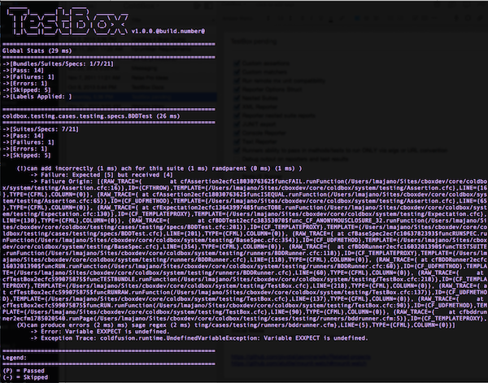

# Reporters

TestBox comes also with a nice plethora of reporters:

* ANTJunit : A specific variant of JUnit XML that works with the ANT junitreport task
* Codexwiki : Produces MediaWiki syntax for usage in Codex Wiki
* Console : Sends report to console
* Doc : Builds semantic HTML to produce nice documentation
* Dot : Builds an awesome dot report
* JSON : Builds a report into JSON
* JUnit : Builds a JUnit compliant report
* Raw : Returns the raw structure representation of the testing results
* Simple : A basic HTML reporter
* Text : Back to the 80's with an awesome text report
* XML : Builds yet another XML testing report
* Tap : A test anything protocol reporter
* Min : A minimalistic view of your test reports

However, you can also build custom reporters very easily.
